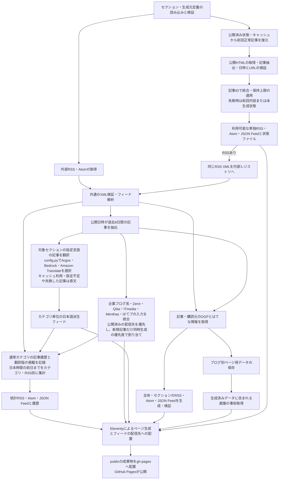

# 企業テックブログRSS

企業の技術ブログ、AI・クラウド・セキュリティなどの更新を、カテゴリ別のWebページとRSS・Atom・JSON Feedで配信する静的サイトです。通常のRSS・Atomと、HTMLの記事一覧から生成するフィードを扱います。

[公開サイト](https://fuhitonakagawa.github.io/my-tech-blog-rss-feed/) ／ [AIカテゴリ](https://fuhitonakagawa.github.io/my-tech-blog-rss-feed/rss/ai/)

このリポジトリは [yamadashy/tech-blog-rss-feed](https://github.com/yamadashy/tech-blog-rss-feed) のフォークです。開発者エージェントの作業方針・調査上の注意点は [AGENTS.md](AGENTS.md) に記載しています。

フォーク元の構成に沿った参考資料は[末尾の折りたたみ](#upstream-reference)から閲覧できます。機能仕様・導入手順の正本は本READMEの1〜8です。

本フォークの独自部分と組み合わせ全体は **GPL-3.0-or-later**（GPLバージョン3またはそれ以降）で提供します。本ソフトウェアはGPLの条件で再配布・改変でき、無保証で提供されます。ライセンス本文は [LICENSE.txt](LICENSE.txt) を参照してください。

フォーク元由来の部分には引き続きMITライセンスが適用され、その本文と著作権表示は [LICENSES/MIT-upstream.txt](LICENSES/MIT-upstream.txt) に保持しています。フォーク元形式のREADMEにあるMIT表記は、本フォーク全体の配布条件を示すものではありません。第三者依存・翻訳モデル・取得コンテンツの適用範囲は [THIRD_PARTY_NOTICES.md](THIRD_PARTY_NOTICES.md) に記載しています。

公開サイトにも`/LICENSE.txt`、`/LICENSES/MIT-upstream.txt`、`/LICENSES/Argos-en-ja-MODEL-NOTICES.md`、`/LICENSES/Argos-zh-en-MODEL-NOTICES.md`、`/THIRD_PARTY_NOTICES.md`を同梱します。ソースコードはサイト内のGitHubリンクから参照できます。

## 目次

- [📋 1. 機能と配信URL](#overview)
- [🚀 2. 導入と実行](#setup)
- [⚙️ 3. 設定](#configuration)
- [📡 4. サイトの追加方法](#サイトの追加方法)
- [🔄 5. 生成フィードの仕様](#generated-feeds)
- [🧪 6. 検証コマンド](#validation)
- [🌐 7. 自動更新と公開](#deployment)
- [📁 8. 構成と処理の流れ](#architecture)
- [フォーク元形式の参考資料](#upstream-reference)

<a id="overview"></a>

## 📋 1. 機能と配信URL

### 1.1. 閲覧と購読

- **カテゴリ別表示**: セクションごとの新着記事、購読リンク、ナビゲーションを提供します。
- **記事情報**: タイトル、概要、元記事URL、公開日時、取得可能なOG画像・はてなブックマーク数を表示します。
- **登録フィード一覧**: ヘッダーの一覧ボタンから、セクションごとの購読元を確認できます。
- **日次投稿統計**: 日本時間の前日までに公開され、取得できた記事数をカテゴリ別にまとめた統計RSSを配信します。
- **重複除外フィード**: 企業ブログ系・Zenn・Qiita・ITmedia・Menthas・はてブの6本に統合し、6本を横断して記事の初回配信先を保持します。詳しくは[重複除外フィード](#deduplicated-feeds)を参照してください。
- **RSSの通知日時**: このサイトが生成するRSSの`pubDate`には、記事を初めて配信した日時を使います。元記事の公開日時は本文の先頭に表示します。
- **表示テーマ**: ライトテーマ固定です。ヘッダー・サイドバー・記事カード・本文背景は白で統一します。購読URLのコピーは青枠のピル型ボタンです。記事のサムネイル、Slack・GitHubアイコン、カテゴリの親子表示を備えます。
- **HTML由来のフィード**: 元サイトにRSSがなくても、定義した記事一覧から単独フィードを配信できます。

公開サイトの基点は `https://fuhitonakagawa.github.io/my-tech-blog-rss-feed` です。次のパスはこの基点からの相対パスです。

| 用途 | パス |
| --- | --- |
| 全体の新着ページ | `/` |
| 全体の集約フィード | `/feeds/rss.xml`、`/feeds/atom.xml`、`/feeds/feed.json` |
| セクションページ | `/rss/<公開パスID>/` |
| セクションの集約フィード | `/rss/<公開パスID>/feeds/rss.xml`、`atom.xml`、`feed.json` |
| ブログ一覧・ブログ別ページ | `/blogs/`、`/blogs/<ブログURLのハッシュ>/` |
| 人気記事ページ | `/hot/` |
| サイトマップ | `/sitemap.xml`、`/site.xml` |

### 1.2. 集約対象の期間

全体・セクションの新着集約は、公開日時が実行時点から過去8日間の範囲にある記事を対象とします。記事ごとの公開日時がないもの、期間外のもの、未来の日時を持つものは対象外です。画面上の「直近1週間」は、この集約結果から過去7日間の記事を表示します。

登録フィード一覧には通常RSSの購読元を表示します。登録やXMLの取得に成功しても、新着集約の記事数が0件になることがあります。ブログ別ページの入力データと生成元ごとの単独フィードには、新着集約より古い記事も含まれます。

### 1.3. 外部RSSの不正データと取得キャッシュ

外部RSS・AtomはXML構造を検証し、記事の表示項目の破損を次の範囲で扱います。内部で生成するフィードは厳格な検証の対象です。

| 入力の状態 | 挙動 |
| --- | --- |
| 概要・本文に不正な制御文字または文字化けの置換文字（U+FFFD）がある | その概要・本文を空にし、正常なタイトル・記事URL・GUID・公開日時を保持する |
| タイトルに不正な制御文字がある | 制御文字を除く。空のタイトルになった記事は除外する |
| 記事URL・GUID・属性・その他の項目に制御文字が残る | 該当記事を除外し、正常な他の記事を取り込む。識別情報を補正して別のURLやIDとして配信しない |
| XML構造・文字参照が不正、RSSではない応答、配信元メタデータに修復対象外の破損がある | 取得元単位のエラーにする |
| 補正・記事除外がある | 配信元の登録名と件数を警告ログへ出す。破損した本文や記事の識別情報はログへ含めない |

RSS・Atom・RSS 1.0の概要、CDATA、HTML形式の本文、文字参照から復元された文字も検査します。通常の改行・タブ・日本語・絵文字は概要の破損として扱いません。記事本文の自然さや内容の正確性を判定するものではありません。

不正文字にはC0/C1制御文字に加え、XML 1.0で使えないU+FFFE・U+FFFF・単独サロゲートを含みます。正常なサロゲートペアは保持します。翻訳結果・翻訳キャッシュの表示文も検査対象です。内部生成XMLと公開済み通知履歴の不正は補正せず拒否します。サイトURLが欠落したRSS同士は同一サイトとして除外せず、それぞれの記事を取得します。

通常RSSの取得キャッシュの有効時間は15分です。定期巡回は毎時ですが、短時間のpush・再実行では取得結果を共有できます。破損したXMLキャッシュは破棄して再取得し、補正・検証済みの応答を保存します。取得失敗時に期限切れデータを新着として扱いません。OGPの24時間キャッシュ、翻訳結果、翻訳モデル、配信済み記事の履歴はそれぞれ独立した保持方針です。

同一サイトの複数RSSも独立して取得し、カテゴリ所属・取得元記録を保持します。ブログ詳細ページは同じサイトの記事の和集合を表示します。Qiitaの企業フィードはOrganizationページで識別します。同じ配信元へのRSS取得は直列で、開始間隔を500ミリ秒以上空けます。429の`Retry-After`中は同じホストへの再送を止め、後続巡回へ委ねます。403・404は同じ実行内で再試行せず、5xx・408・通信障害は既定の再試行対象です。

QiitaのタグRSSは、同じタグ・集約対象期間の記事を公式APIで補完します。1ページ100件、1タグ10ページ、全タグ合計45リクエスト・120秒を上限とします。公開日には`created_at`を使い、非公開・不正データ・期間外の記事は含めません。15分以内の再実行では取得結果を再利用し、期間内に取得した記事は先頭ページから消えても保持します。APIエラーや予算切れでは取得済みの記事と元RSSを配信し、`[qiita-supplement] incomplete`を警告します。人気フィードや企業フィードへタグAPIの集合を混ぜません。

Qiita企業フィードは20ページまで、全企業合計120秒の範囲で後続ページを取得します。公開・更新日時の両方が対象期間より古いページ、空ページ、重複ページで終了します。途中失敗や上限では取得済み記事を保持し、`[qiita-organization] incomplete`を警告します。取得元RSSのURLとカテゴリ所属は維持します。

メルカリのRSS取得に失敗した場合は、公式ブログ一覧のHTMLに含まれる記事URL・タイトル・公開時刻を取得します。公開時刻は日本時間として解釈し、元のRSS URLとカテゴリを維持します。HTMLに掲載されている記事だけが対象で、概要は補作しません。HTMLも取得できない場合は取得失敗として扱います。

`publicationDateSource: "article-metadata"`を指定した取得元は、RSSの公開日時がない記事だけ、同一サイトのHTMLメタデータ（Articleの`datePublished`または`article:published_time`）を確認します。Google Developers Blogに適用されます。日付のみはUTC 0時とし、異なる公開日候補がある場合・日付不正・取得失敗では補いません。1回50記事・合計60秒まで、確認した公開日を14日キャッシュします。既存の公開日を上書きせず、更新日や取得時刻も代用しません。

HEARTBEATSの取得元は`https://heartbeats.jp/feed/?post_type=hbblog`です。Preferred NetworksとMongoDBは公開ブログページから単独RSSを生成し、各カテゴリへ取り込みます。公開パスはそれぞれ`/feeds/generated/preferred-networks/rss.xml`、`/feeds/generated/mongodb-blog/rss.xml`です。元のRSSをSlackへ直接登録している場合は、購読先も変更する必要があります。カテゴリ・翻訳・dedupの購読URLは共通です。

<a id="setup"></a>

## 🚀 2. 導入と実行

### 2.1. 必要な環境

- **ランタイム**: Node.js 24以上。CIの使用バージョンは [ランタイム指定（`.tool-versions`）](.tool-versions) を参照してください。
- **パッケージ管理**: npm 11.19.1以上。依存関係は [パッケージ定義（`package.json`）](package.json) と [ロックファイル（`package-lock.json`）](package-lock.json) で管理します。
- **ローカル翻訳**: Python 3.12とuv。依存関係は [Pythonパッケージ定義（`pyproject.toml`）](pyproject.toml) と [Pythonロックファイル（`uv.lock`）](uv.lock) で固定します。
- **接続先**: パッケージレジストリ、外部RSS・HTML・画像の公開URLにアクセスできる環境が必要です。

### 2.2. インストールと初回生成

リポジトリのルートで実行します。

```bash
node --version
npm --version
npm install --global npm@11.19.1
npm ci
uv sync --frozen
uv run --frozen python scripts/translation/setup_model.py
npm run feed-generate
npm run site-prepare
npm run site-build
```

`npm ci`はロックファイルの依存関係をインストールします。依存のインストールスクリプトは、`package.json`の`allowScripts`で許可したパッケージ・バージョンを実行対象とします。フィード取得・生成の中間ファイルはサイト入力ディレクトリに、配信用の静的ファイルは `public/` に出力されます。

### 2.3. ローカルでの閲覧

フィード生成後に次を実行し、`http://localhost:8080/` を開きます。

```bash
npm run site-serve
```

`site-serve`はサイトのビルドとプレビューを行います。フィード定義や抽出処理を編集した場合は、`feed-generate`で入力データを再生成してください。

### 2.4. 実行コマンド

| コマンド | 用途・前提 |
| --- | --- |
| `npm run feed-generate` | 通常RSS取得、HTML由来のフィード生成、全体・セクションの集約、XML検証 |
| `npm run site-prepare` | 生成済みブログデータを対象とする画像の事前取得。`feed-generate`の出力が必要 |
| `npm run site-build` | Eleventyによる静的サイトの出力。生成済みフィードデータが必要 |
| `npm run site-serve` | 静的サイトのローカルプレビュー |
| `npm run build` | `feed-generate`と`site-build`の連続実行。画像の事前取得は含まない |
| `npm run cache-prune` | 期限を超えた取得キャッシュ・生成画像の削除。サイト生成前に使用 |
| `npm run register-index` | Google Indexing APIへのURL通知。通常の生成・公開とは独立した任意処理 |

Indexing APIへの通知には、生成済みブログデータ、対象サイトの権限、`storage/service_account.json`のサービスアカウント認証情報が必要です。このファイルはGit管理外で扱います。通常のRSS生成とローカル閲覧にはサービスアカウントは不要です。

### 2.5. コミット前の検査

開発用のGitフックは、依存関係のインストール後に各クローンで有効にします。

```bash
uv run --frozen --group hooks pre-commit install
```

[コミット前検査の設定（`.pre-commit-config.yaml`）](.pre-commit-config.yaml) は、ステージ済みのテキストファイルを対象にBiomeとSecretlintを実行します。Biomeの対象範囲・除外は`biome.json`、秘密情報の検査ルール・除外は`.secretlintrc.json`と`.secretlintignore`を使用します。検査エラー時はコミットを停止します。検査は読み取り専用で、自動修正・自動ステージはありません。部分的にステージしたファイルでは、未ステージの変更を一時退避してステージ済みの内容を検査し、終了時に復元します。

Node.jsとnpmの前提条件は2.1と同じです。フックは`npm ci`で導入したローカル依存を使用します。フック管理用のpre-commitは`pyproject.toml`の`hooks`依存グループと`uv.lock`で固定します。Python環境を同期した後は、上記コマンドでフック用依存も揃えてください。

手動の検査コマンドは以下です。全ファイル検査は、追跡対象ファイルの作業ツリー上の内容を検査します。

```bash
uv run --frozen --group hooks pre-commit run
uv run --frozen --group hooks pre-commit run --all-files
```

型検査・テスト・サイト生成はCIで実行します。手元での全体検証には6のコマンドを使用します。

<a id="configuration"></a>

## ⚙️ 3. 設定

| 設定対象 | 定義元 |
| --- | --- |
| サイトURL・タイトル・説明・著者・集約期間・取得上限 | [共通設定（`src/common/constants.ts`）](src/common/constants.ts) |
| カテゴリナビ・登録フィード一覧の表示順 | [表示カテゴリ一覧（`src/resources/display-section-list.ts`）](src/resources/display-section-list.ts) |
| セクションの表示名・所属フィード・基本順 | [セクション定義（`src/resources/sections/`）](src/resources/sections/) |
| HTML由来の生成元・抽出設定 | [生成元定義（`src/resources/generated-feeds/`）](src/resources/generated-feeds/) |
| 日次統計の表示名・集計時間帯・保持期間 | [統計定義（`src/resources/stats/daily-stats.json`）](src/resources/stats/daily-stats.json) |
| Eleventyの入力・出力・配信ファイル | [サイト設定（`eleventy.config.ts`）](eleventy.config.ts) |
| 定期更新・公開先ブランチ | [更新ワークフロー（`.github/workflows/generate-feed.yml`）](.github/workflows/generate-feed.yml) |

通常フィードの設定は共通設定とJSON定義を参照します。翻訳の非機密設定は [翻訳設定（`scripts/translation/config.py`）](scripts/translation/config.py) の `CONFIG = TranslationConfig(...)` で指定し、Gitで管理します。Argosの実行に`.env`の作成は不要です。AWSの短期認証情報はActionsが実行中だけ環境変数へ設定します。フォーク先では、共通設定のサイトURL、リポジトリURL、著者、画像、任意のアクセス解析設定を配信先に合わせます。

| Python設定 | 用途・既定値 |
| --- | --- |
| `provider` | `argos` / `bedrock` / `amazon-translate`。既定は `argos` |
| `timeout_ms` | 翻訳バッチの制限時間。1,200,000ミリ秒 |
| `cpu_threads` | ArgosのCPU推論スレッド数。2 |
| `packages_dir` / `runtime_dir` | モデル `.argos/packages` / 補助データ `.argos/runtime` |
| `log_level` | PythonブリッジのJSONログレベル。`INFO`、標準エラーへ出力 |
| `aws_region` / `aws_role_arn` | リージョン / OIDCで引き受けるIAMロールARN。空欄 |
| `bedrock_model_id` | Converse対応のモデルIDまたは推論プロファイルID。空欄 |
| `bedrock_max_tokens` / `bedrock_temperature` | 出力上限4,096 / temperature 0.0 |
| `aws_request_timeout_seconds` / `aws_max_attempts` | AWS読込タイムアウト60秒 / 最大試行回数2 |
| `max_input_bytes` | AWSに渡す1テキストのUTF-8上限。10,000バイト |

AWS翻訳を使う場合の非機密設定例です。リージョン・ロール・モデルは自分のAWS環境に合わせて指定します。

```python
CONFIG = TranslationConfig(
    provider="bedrock",
    aws_region="ap-northeast-1",
    aws_role_arn="arn:aws:iam::123456789012:role/rss-translation",
    bedrock_model_id="利用するConverse対応モデルID",
)
```

Amazon Translateは`provider="amazon-translate"`とリージョン・ロールを指定します。Bedrockはこれに加えてモデルIDが必須です。必須設定が空ならOIDC認証・AWS APIを開始せず、未翻訳の記事を原文で配信します。アクセスキーをコード、`.env`、GitHub Secrets / Variablesへ登録する必要はありません。

<a id="サイトの追加方法"></a>

## 📡 4. サイトの追加方法

### 4.1. 通常のRSS・Atom

対象セクションの`feeds`へ、表示名とフィードURLを登録します。次は [AIセクションの定義（`my-tech-blog-ai.json`）](src/resources/sections/my-tech-blog-ai.json) にある通常RSSです。

```json
{
  "label": "OpenAI Developers",
  "url": "https://developers.openai.com/rss.xml",
  "language": "en"
}
```

```json
{
  "label": "Google Developers Blog",
  "url": "https://developers.googleblog.com/feeds/posts/default",
  "language": "en"
}
```

通常RSSのURLは外部の購読元です。HTML由来の生成フィード用ディレクトリへの定義は不要です。フィード名とURLはセクションをまたいで一意にします。

英語の翻訳対象には`"language": "en"`を指定します。指定可能な値は`ja`・`en`・`zh`・`mixed`・`unknown`で、未指定は`unknown`です。中国語には`zh`を使います。生成フィードは生成元定義の言語を使用します。全取得元が同じ既知言語の通常カテゴリは、その言語をRSSに設定します。翻訳定義の`sourceLanguage`と一致するソースが対象です。`en`は英日、`zh`は中日翻訳を使用します。

企業の技術ブログに加え、AIの公式開発者ブログ・製品情報など、セクションの対象に合う配信元を扱います。投稿サービス上の企業ブログも、運営主体と内容を確認して登録します。

### 4.2. セクション

`src/resources/sections/<セクションID>.json`を1セクション1ファイルで用意します。

```json
{
  "order": 400,
  "title": "表示名",
  "feeds": [
    {
      "label": "フィード名",
      "url": "https://example.com/feed.xml"
    }
  ]
}
```

- **ID**: ファイル名の拡張子を除いた部分です。先頭は英小文字または数字、以降は英小文字・数字・ハイフンを使用します。
- **公開パス**: [公開パス対応（`src/resources/section-paths.json`）](src/resources/section-paths.json)は、管理用IDと固定の公開パスIDを対応付けます。未指定のIDは同じ文字列を公開パスに使います。例えば`my-tech-blog-ai-translated-jp`の公開パスIDは`ai-jp`で、RSSは`/rss/ai-jp/feeds/rss.xml`です。公開URLを識別子とする通知履歴・重複除外の配信先も同じ対応を使います。
- **Slackとの対応**: 管理用IDはSlackチャンネル名の`#`と、末尾または`-translated-jp`・`-dedup`の直前にある`-feed`を除いた値です。例えば`#my-tech-blog-ai-feed-translated-jp`は`my-tech-blog-ai-translated-jp`、`#my-tech-blog-jp-feed-dedup`は`my-tech-blog-jp-dedup`です。日次統計の定義ファイルは`daily-stats.json`です。画面の表示名は`title`、閲覧・配信・保存先は公開パスIDで決まります。
- **表示順**: 表示順の正本は`display-section-list.ts`の`SECTION_DISPLAY_ORDER`です。カテゴリナビと登録フィード一覧は、企業・個人ブログ、AI・開発、クラウド、セキュリティ、Zenn・Qiita、ニュース・メディア、資料・書籍の順です。登録フィード一覧では、重複除外版は集約元カテゴリの直前、翻訳版は原文カテゴリの直後に置きます。Zenn・QiitaのPhysical AIは各サービスのAIカテゴリに続きます。左のカテゴリナビは、重複除外版を親・集約元カテゴリを子、日本語訳を親・原文カテゴリを子とするツリーで常時表示します。枝線と字下げで親子関係を示し、折りたたみ操作はありません。親・子ともカテゴリページへのリンクです。最上位カテゴリは単独カテゴリも含めて太字、子カテゴリは通常の太さで表示します。PCでは画面左端で高さ全体を使い、カテゴリ一覧を独立して縦スクロールできます。ヘッダーは画面上部の全幅、記事・フッターは右側に配置し、購読URLのコピーフォームは右側のコンテンツ幅を使います。スマホではヘッダーの下、記事の上に高さを抑えて一覧を配置します。現在のカテゴリを一覧上部とリンクの強調で示し、JavaScriptなしで利用できます。表示順に未指定の通常カテゴリは末尾へ`order`の昇順・同値ではID順で並びます。`order`は原則として10刻みの未使用値を選びます。表示順はdedupの配信優先度と独立しています。
- **登録フィード一覧**: ヘッダーの箇条書きアイコン付き「フィード一覧」から開きます。カテゴリ名と取得元件数・種別を表示し、カテゴリを開くと、カテゴリページ・購読RSS・取得元RSSを確認できます。重複除外版は集約元カテゴリ、日本語訳は翻訳元カテゴリをリンクで示します。現在のカテゴリは初期表示で展開されます。閉じるボタン、背景クリック、Escapeキーで閉じ、フォーカスは一覧ボタンへ戻ります。
- **表示名**: `title`がナビゲーション、ページ見出し、集約フィードのタイトルに使用されます。
- **生成物**: ページ、RSS・Atom・JSON Feed、ナビゲーション、サイトマップが定義から生成されます。

`zenn-trend`は「Zenn トレンド」、`qiita-trend`は「Qiita 人気記事」で、各サービスのトレンド・人気記事RSSを対象にします。タグ別のカテゴリとは別の取得元です。表示名の変更でカテゴリIDや購読URLは変わりません。

Zenn・Qiitaの「AI関連タグ」は12個、「Cloud関連タグ」は6個のタグのRSSをまとめます。「Securityタグ」は各サービスのSecurityタグ1個を対象にします。

### 4.3. RSS非対応ページ

`src/resources/generated-feeds/<生成フィードID>.json`に生成元を定義します。IDの文字制約はセクションIDと同じです。次はClaudeの記事一覧に対するCSS抽出設定です。

```json
{
  "schemaVersion": 1,
  "label": "Claude Code Blog",
  "pageUrl": "https://claude.com/blog-category/claude-code",
  "language": "en",
  "extractor": {
    "type": "css",
    "itemSelector": "main .blog_cms_grid > .blog_cms_item",
    "titleSelector": "[fs-list-field=\"heading\"]",
    "linkSelector": "a[fs-list-element=\"item-link\"]",
    "dateSelector": "[fs-list-field=\"date\"]",
    "timeZoneOffset": "+00:00",
    "categorySelector": "[fs-list-field=\"category\"]"
  },
  "pollIntervalMinutes": 60,
  "maxItems": 50
}
```

| 項目 | 仕様 |
| --- | --- |
| `schemaVersion` | `1` |
| `label`・`pageUrl`・`language` | 表示名、取得する記事一覧URL、言語 |
| `extractor` | `css`、または許可リストに登録された`adapter` |
| `pollIntervalMinutes` | 正常な保存済み状態を再利用できる最小確認間隔。定期実行の起動間隔とは別の設定 |
| `maxItems` | 保存済み記事と取得記事の統合後に保持する最大件数 |

CSS方式では`itemSelector`、`titleSelector`、`linkSelector`、`dateSelector`、`timeZoneOffset`が必須です。記事要素内の子孫要素から値を取得し、リンクには`href`属性を使用します。任意項目は`dateAttribute`、`timeSelector`、`timeAttribute`、`summarySelector`、`categorySelector`、`creatorSelector`です。`timeAttribute`には`timeSelector`の指定も必要です。

固有の抽出規則が必要な場合は、[アダプター許可リスト（`adapter-registry.ts`）](src/feed/generated/adapter-registry.ts) に関数を登録し、`extractor`を`{"type":"adapter","name":"登録名"}`とします。定義JSONは任意のJavaScriptやファイルパスを実行しません。

所属はセクション側の`feeds`に指定します。同じ生成フィードを複数セクションに所属させることはできません。

```json
{
  "generatedFeedId": "claude-code-blog"
}
```

### 4.4. 生成元の一覧

| 生成フィードID | 表示名 | セクション | 抽出方式 |
| --- | --- | --- | --- |
| `serverless-operations` | Serverless Operations | `my-tech-blog-jp` | `serverless-operations`アダプター |
| `anthropic-news` | Anthropic Newsroom | `my-tech-blog-ai` | `anthropic-news`アダプター |
| `claude-announcements` | Claude Product announcements | `my-tech-blog-ai` | CSS |
| `claude-code-blog` | Claude Code Blog | `my-tech-blog-ai` | CSS |
| `mongodb-blog` | MongoDB Blog | `my-tech-blog-db` | `mongodb-blog`アダプター |
| `preferred-networks` | Preferred Networks Tech Blog | `my-tech-blog-jp` | CSS |
| `lerobot-tutorial-updates` | Robot Learning: A Tutorial（教材更新） | `my-tech-blog-robotics` | `huggingface-commits`アダプター |
| `leaderobot-news` | 机器人大讲堂（ロボット大講堂） | `my-tech-blog-robotics-zh` | `leaderobot-news`アダプター |

Roboticsの教材更新は、ETH講義の[公式教材リポジトリのAtom](https://github.com/mees-robot-learning-course/ethz-course-2026/commits/main.atom)と、Hugging Faceの[教材変更履歴](https://huggingface.co/spaces/lerobot/robot-learning-tutorial/commits/main)を対象とします。記事はコミットのタイトル・URL・日時で識別します。講義の開催日や動画公開日は別のイベントです。教材自体の入口は[ETH講義ページ](https://cvg.ethz.ch/lectures/Robot-Learning/)と[Robot Learning: A Tutorial](https://huggingface.co/spaces/lerobot/robot-learning-tutorial)です。IEEE Video Fridayは既存のIEEE Spectrum Robotics RSSに含まれます。

机器人大讲堂は「Robotics（中国語）」に分類し、公式記事一覧の公開済みデータからタイトル・URL・概要を生成します。公開日は`publishTime`の日付を中国標準時（UTC+08:00）の午前0時として扱い、作成日時・更新日時を代用しません。一覧1ページの取得分と保存済み記事を統合します。

| 購読先 | 公開時のRSS URL |
| --- | --- |
| 教材更新を含むRobotics | `https://fuhitonakagawa.github.io/my-tech-blog-rss-feed/rss/robotics/feeds/rss.xml` |
| Robotics（中国語） | `https://fuhitonakagawa.github.io/my-tech-blog-rss-feed/rss/robotics-zh/feeds/rss.xml` |
| Robot Learning教材の変更履歴 | `https://fuhitonakagawa.github.io/my-tech-blog-rss-feed/feeds/generated/lerobot-tutorial-updates/rss.xml` |
| 机器人大讲堂 | `https://fuhitonakagawa.github.io/my-tech-blog-rss-feed/feeds/generated/leaderobot-news/rss.xml` |

教材の変更履歴も通常カテゴリでは過去8日以内の更新が対象です。単独生成フィードには設定件数までの過去の変更履歴を保持するため、単独フィードの記事数と通常カテゴリの新着数は異なります。

<a id="generated-feeds"></a>

## 🔄 5. 生成フィードの仕様

### 5.1. 記事と日時

- **記事ID**: 正規化した元記事URLです。識別用クエリは保持し、追跡用クエリを除外します。
- **公開日時**: 元ページの掲載日を使用します。英語の月名・3文字略称にも対応し、存在しない日付を拒否します。時刻がないCSS抽出では指定タイムゾーンの午前0時、Anthropic NewsroomではUTCの午前0時として扱います。
- **必須情報**: タイトル・記事URL・公開日時が不正な記事は除外します。公開日時を実行時刻で補うことはありません。有効記事0件は生成元の異常です。
- **保持内容**: 前回正常記事と今回記事をIDで統合し、同一IDの値は今回取得分を優先します。公開日時の降順、IDの昇順で並べ、`maxItems`まで保持します。
- **内容更新日時**: 生成フィードの内容が同じ場合は`contentUpdatedAt`を維持します。記事の公開日時、確認日時とは別の値です。

### 5.2. 配信ファイルと状態

生成元ごとの基点は`/feeds/generated/<生成フィードID>/`です。

このリポジトリの公開サイトでのURL例です。購読用RSSはサイトごとに独立しています。

| 生成フィード | 購読用RSS |
| --- | --- |
| Serverless Operations | [https://fuhitonakagawa.github.io/my-tech-blog-rss-feed/feeds/generated/serverless-operations/rss.xml](https://fuhitonakagawa.github.io/my-tech-blog-rss-feed/feeds/generated/serverless-operations/rss.xml) |
| Anthropic Newsroom | [https://fuhitonakagawa.github.io/my-tech-blog-rss-feed/feeds/generated/anthropic-news/rss.xml](https://fuhitonakagawa.github.io/my-tech-blog-rss-feed/feeds/generated/anthropic-news/rss.xml) |
| Claude Product announcements | [https://fuhitonakagawa.github.io/my-tech-blog-rss-feed/feeds/generated/claude-announcements/rss.xml](https://fuhitonakagawa.github.io/my-tech-blog-rss-feed/feeds/generated/claude-announcements/rss.xml) |
| Claude Code Blog | [https://fuhitonakagawa.github.io/my-tech-blog-rss-feed/feeds/generated/claude-code-blog/rss.xml](https://fuhitonakagawa.github.io/my-tech-blog-rss-feed/feeds/generated/claude-code-blog/rss.xml) |

Anthropic Newsroomの [Atom](https://fuhitonakagawa.github.io/my-tech-blog-rss-feed/feeds/generated/anthropic-news/atom.xml)、[JSON Feed](https://fuhitonakagawa.github.io/my-tech-blog-rss-feed/feeds/generated/anthropic-news/feed.json)、[生成状態（status.json）](https://fuhitonakagawa.github.io/my-tech-blog-rss-feed/feeds/generated/anthropic-news/status.json) も同じ基点から参照できます。


| ファイル | 内容 |
| --- | --- |
| `rss.xml`・`atom.xml`・`feed.json` | 購読用のRSS・Atom・JSON Feed |
| `snapshot.json` | 記事、生成元情報、内容更新日時などの復元用データ |
| `status.json` | `state`、確認日時、最終成功日時、内容更新日時 |

| `state` | 配信内容・画面表示 |
| --- | --- |
| `ok` | 正常な記事を配信。登録フィード一覧は「正常」 |
| `stale` | 取得・抽出に失敗し、前回正常内容を配信。一覧は「前回正常データを配信中」 |
| `unavailable` | 利用できる前回正常内容がなく、状態ファイルのみ出力。一覧には当該生成元の項目を表示しない |

未定義ID、重複する名前・URL、未登録アダプター、設定形式の不正はビルドエラーです。通信・抽出エラーは生成元ごとに状態へ反映します。

### 5.3. 接続と保存の制約

生成元HTMLの取得には公開ネットワーク接続の検証と10秒のタイムアウトがあり、HTMLレスポンスのサイズ上限は5 MiBです。1回の確認は一覧ページ1ページを対象とし、追加ページの巡回やログインは対象外です。

記事URLは公開可能なHTTP・HTTPSに限定し、認証情報、署名、秘密情報を含むURLを拒否します。状態ファイルには元記事の公開情報だけを保存します。公開済み`gh-pages`の生成状態を復元元とし、Actions Cacheを副経路として利用します。

### 5.4. 日本語翻訳のカテゴリ統合フィード

日本語原文と英語原文のカテゴリは次の区分です。`aws`・`googlecloud`は英語、`security`は日本語中心の配信元を扱います。`security`には日英混在の配信元も含まれます。

| カテゴリID | 表示名 | 対象 | 購読用RSS |
| --- | --- | --- | --- |
| `aws-ja` | AWS 日本語 | AWS の最新情報・Amazon Web Services ブログの日本語RSS | [RSS](https://fuhitonakagawa.github.io/my-tech-blog-rss-feed/rss/aws-ja/feeds/rss.xml) |
| `googlecloud-ja` | Google Cloud 日本語 | Google Cloud 日本語ブログ | [RSS](https://fuhitonakagawa.github.io/my-tech-blog-rss-feed/rss/google-cloud-ja/feeds/rss.xml) |
| `security-en` | Security English | GitHub Security・Microsoft Security・Trail of Bits・Wiz・Aikidoの英語RSS | [RSS](https://fuhitonakagawa.github.io/my-tech-blog-rss-feed/rss/security-en/feeds/rss.xml) |

`*-ja`は日本語原文、`*-jp`は英語からの日本語翻訳です。翻訳版`security-translated-jp`の入力元は`security-en`です。

JVNの脆弱性情報は専用カテゴリ`jvn`で扱います。取得元はJVNRSSとJVNDBの2本で、Slackの`#jvn-feed`に対応します。[JVNの購読用RSS](https://fuhitonakagawa.github.io/my-tech-blog-rss-feed/rss/jvn/feeds/rss.xml)は通常の集約フィードです。

翻訳派生フィードは、カテゴリ内の英語または中国語ソースの記事を1つにまとめたRSSです。タイトルとRSS内の概要文を日本語に翻訳し、元記事のURL・GUID・公開日時・著者・カテゴリ・ブログ名・画像・ブックマーク数を保持します。元ページの本文取得、全文翻訳、要約は対象外です。

通常・翻訳の集約フィードは、RSS・JSONでは元の文字列GUIDを保持します。AtomのIDは公開可能なHTTP(S) URLとし、それ以外のGUIDでは記事URLを使います。JSON Feedの`title`・`summary`・`_custom`はプレーンテキスト、`content_html`はHTMLとして配信し、`image`は画像URLの文字列です。

記事識別子は8,192文字以下です。上限を超える記事は警告を記録して除外し、他の記事は配信します。HTML由来の単独RSSにも同じ上限が適用されます。重複除外は配信可能な候補から選び、優先候補が不正でも別入力の正常な同一記事を配信します。表示タグは不正文字を除いた先頭2,000文字（UTF-16長）を使用し、切断位置に単独サロゲートを残しません。画像の説明文からも不正文字を除きます。公開済み通知履歴に不整合がある場合は、履歴を初期化せず公開を停止します。

OGP・外部画像・faviconの取得は、本文の受信を含め1リクエスト10秒を上限とします。画像の待機キューと各取得の期限は独立しています。個別のOGP取得失敗は当該OGPなしで継続し、画像の取得失敗は利用可能なキャッシュまたは代替表示へ切り替えます。

同一実行の同じ記事URLは、カテゴリやタグが複数でもOGP取得とリトライを共有します。記事のカテゴリ所属は保持します。はてなブックマーク件数の取得では、記事URL内のクエリ・日本語・日付アンカーを維持します。

RSS・OGP・画像の応答は圧縮前後とも10 MiB、HTML由来フィードの生成元ページは展開後5 MiBを上限とし、受信中に超過した時点で中断します。`Content-Length`の欠落や圧縮応答でも上限を適用します。画像の有無はRSSの公開条件に含めません。Atomの不正な公開・更新日時を持つ記事は当該記事だけを除外し、正常な前後の記事を保持します。日時の欠落を取得日時で補完せず、XML構文や文字参照自体が壊れた応答はフィード単位で拒否します。


| 元セクション | 日本語派生ID | 表示名 | 閲覧ページ | 購読用RSS |
| --- | --- | --- | --- | --- |
| `my-tech-blog-ai` | `my-tech-blog-ai-translated-jp` | AI - Translated Japanese | [ページ](https://fuhitonakagawa.github.io/my-tech-blog-rss-feed/rss/ai-jp/) | [RSS](https://fuhitonakagawa.github.io/my-tech-blog-rss-feed/rss/ai-jp/feeds/rss.xml) |
| `aws` | `aws-translated-jp` | AWS - Translated Japanese | [ページ](https://fuhitonakagawa.github.io/my-tech-blog-rss-feed/rss/aws-jp/) | [RSS](https://fuhitonakagawa.github.io/my-tech-blog-rss-feed/rss/aws-jp/feeds/rss.xml) |
| `azure` | `azure-translated-jp` | Azure - Translated Japanese | [ページ](https://fuhitonakagawa.github.io/my-tech-blog-rss-feed/rss/azure-jp/) | [RSS](https://fuhitonakagawa.github.io/my-tech-blog-rss-feed/rss/azure-jp/feeds/rss.xml) |
| `googlecloud` | `googlecloud-translated-jp` | Google Cloud - Translated Japanese | [ページ](https://fuhitonakagawa.github.io/my-tech-blog-rss-feed/rss/google-cloud-jp/) | [RSS](https://fuhitonakagawa.github.io/my-tech-blog-rss-feed/rss/google-cloud-jp/feeds/rss.xml) |
| `hacker-news` | `hacker-news-translated-jp` | Hacker News - Translated Japanese | [ページ](https://fuhitonakagawa.github.io/my-tech-blog-rss-feed/rss/hacker-news-jp/) | [RSS](https://fuhitonakagawa.github.io/my-tech-blog-rss-feed/rss/hacker-news-jp/feeds/rss.xml) |
| `my-tech-blog-db` | `my-tech-blog-db-translated-jp` | Database - Translated Japanese | [ページ](https://fuhitonakagawa.github.io/my-tech-blog-rss-feed/rss/db-jp/) | [RSS](https://fuhitonakagawa.github.io/my-tech-blog-rss-feed/rss/db-jp/feeds/rss.xml) |
| `my-tech-blog-engineering` | `my-tech-blog-engineering-translated-jp` | Engineering - Translated Japanese | [ページ](https://fuhitonakagawa.github.io/my-tech-blog-rss-feed/rss/engineering-jp/) | [RSS](https://fuhitonakagawa.github.io/my-tech-blog-rss-feed/rss/engineering-jp/feeds/rss.xml) |
| `my-tech-blog-platform` | `my-tech-blog-platform-translated-jp` | Platform - Translated Japanese | [ページ](https://fuhitonakagawa.github.io/my-tech-blog-rss-feed/rss/platform-jp/) | [RSS](https://fuhitonakagawa.github.io/my-tech-blog-rss-feed/rss/platform-jp/feeds/rss.xml) |
| `my-tech-blog-programming` | `my-tech-blog-programming-translated-jp` | Programming - Translated Japanese | [ページ](https://fuhitonakagawa.github.io/my-tech-blog-rss-feed/rss/programming-jp/) | [RSS](https://fuhitonakagawa.github.io/my-tech-blog-rss-feed/rss/programming-jp/feeds/rss.xml) |
| `my-tech-blog-robotics` | `my-tech-blog-robotics-translated-jp` | Robotics - Translated Japanese | [ページ](https://fuhitonakagawa.github.io/my-tech-blog-rss-feed/rss/robotics-jp/) | [RSS](https://fuhitonakagawa.github.io/my-tech-blog-rss-feed/rss/robotics-jp/feeds/rss.xml) |
| `security-github` | `security-github-translated-jp` | GitHub Security Advisory - Translated Japanese | [ページ](https://fuhitonakagawa.github.io/my-tech-blog-rss-feed/rss/security-advisory-jp/) | [RSS](https://fuhitonakagawa.github.io/my-tech-blog-rss-feed/rss/security-advisory-jp/feeds/rss.xml) |
| `security-en` | `security-translated-jp` | Security - Translated Japanese | [ページ](https://fuhitonakagawa.github.io/my-tech-blog-rss-feed/rss/security-jp/) | [RSS](https://fuhitonakagawa.github.io/my-tech-blog-rss-feed/rss/security-jp/feeds/rss.xml) |
| `techcrunch` | `techcrunch-translated-jp` | TechCrunch - Translated Japanese | [ページ](https://fuhitonakagawa.github.io/my-tech-blog-rss-feed/rss/techcrunch-jp/) | [RSS](https://fuhitonakagawa.github.io/my-tech-blog-rss-feed/rss/techcrunch-jp/feeds/rss.xml) |

定義元は [翻訳フィード専用ディレクトリ（`src/resources/translated-feeds/`）](src/resources/translated-feeds/) です。1カテゴリにつき1ファイルで、ファイル名が日本語派生IDになります。例えば [AI - Translated Japaneseの定義（`my-tech-blog-ai-translated-jp.json`）](src/resources/translated-feeds/my-tech-blog-ai-translated-jp.json) は次の形式です。

```json
{
  "title": "AI - Translated Japanese",
  "sourceSectionId": "my-tech-blog-ai",
  "sourceLanguage": "en",
  "targetLanguage": "ja"
}
```

中国語RSSは取得元へ`"language": "zh"`を指定します。`my-tech-blog-robotics-zh`に登録した中国語ソースは、共通の中日翻訳処理へ自動で含まれます。ブログごとの翻訳コードは不要です。別の中国語カテゴリを作る場合は、次の形式で翻訳定義を置きます。

```json
{
  "title": "Research（中国語） - Translated Japanese",
  "sourceSectionId": "research-zh",
  "sourceLanguage": "zh",
  "targetLanguage": "ja"
}
```

Robotics（中国語）の日本語版は、公開時に`/rss/robotics-zh-jp/feeds/rss.xml`、閲覧ページは`/rss/robotics-zh-jp/`となります。原文側は`/rss/robotics-zh/`です。

通常カテゴリの定義は`src/resources/sections/`、翻訳フィードの定義は`src/resources/translated-feeds/`で管理します。翻訳結果は`src/site/translated-feeds/<公開パスID>/feeds/`へ出力し、通常カテゴリの生成物である`src/site/section-feeds/`とは保存先を分けます。

配信先は`/rss/<公開パスID>/feeds/rss.xml`、`atom.xml`、`feed.json`、閲覧ページは`/rss/<公開パスID>/`です。AI - Translated JapaneseのRSSは`/rss/ai-jp/feeds/rss.xml`となります。対象記事がない場合も空のフィードとページを出力します。

AIの翻訳フィードのURL例です。管理用IDは`my-tech-blog-ai-translated-jp`、公開パスIDは`ai-jp`です。表示名の` - Translated Japanese`とも別に管理します。

- **閲覧ページ**: [https://fuhitonakagawa.github.io/my-tech-blog-rss-feed/rss/ai-jp/](https://fuhitonakagawa.github.io/my-tech-blog-rss-feed/rss/ai-jp/)
- **購読用RSS**: [https://fuhitonakagawa.github.io/my-tech-blog-rss-feed/rss/ai-jp/feeds/rss.xml](https://fuhitonakagawa.github.io/my-tech-blog-rss-feed/rss/ai-jp/feeds/rss.xml)
- **Atom**: [AI翻訳フィードのAtom](https://fuhitonakagawa.github.io/my-tech-blog-rss-feed/rss/ai-jp/feeds/atom.xml)
- **JSON Feed**: [AI翻訳フィードのJSON](https://fuhitonakagawa.github.io/my-tech-blog-rss-feed/rss/ai-jp/feeds/feed.json)

翻訳フィードのローカル保存先は`translated-feeds/`、公開URLは`/rss/`配下です。HTML由来の単独フィードは`/feeds/generated/`配下となります。フォーク先では、URL先頭を自分の公開サイトの基点に置き換えます。

Hacker Newsの取得元は [Hacker News - Japanese](https://hevinxx.github.io/hn-summary-and-translate/rss-ja.xml) です。取得元の名前とURLは日本語版ですが、実際のタイトル・概要が英語のため、登録言語は`en`とします。`hacker-news`は取得元の記事、`hacker-news-translated-jp`は本リポジトリの翻訳機による日本語の記事を配信します。

各派生フィードは、指定元セクションかつ定義の`sourceLanguage`（`en`または`zh`）に一致するソースを対象とします。日本語・混在・言語未指定のソースは含めません。記事の集約期間は通常フィードと同じで、取得記事に公開日時がなければ翻訳対象にも入りません。

Google Cloudの日本語派生では、Google Cloud Release Notes（`https://cloud.google.com/feeds/gcp-release-notes.xml`）に限り、サービス名を原文表記でタイトルに含めます。タイトルは`Google Cloud更新：API Gateway、BigQuery、Cloud Interconnectほか（2026-09-29）`の形式で、先頭3サービスと元記事の公開日（UTC）を表示します。本文先頭には重複を除いた全サービス名を付け、その後に翻訳概要を1回掲載します。通常の概要・本文の文字数上限は適用されるため、配信内容は末尾が省略される場合があります。サービス見出しがない記事は通常の翻訳表示です。翻訳器を利用できない場合もサービス名の表示形式は共通で、概要は原文になります。元の通常カテゴリ、原文タイトル、記事の単位・ID・URL・公開日時、購読URLは保持します。

既定の翻訳器はローカルのArgos Translateを使用し、外部翻訳APIの契約・キーを必要としません。英日・中英モデルは固定バージョンとSHA-256で検証し、`.argos/`に保持します。翻訳経路は`config.py`の`translation_routes`で管理し、英語は`en → ja`、中国語（簡体字）は`zh → en → ja`を使います。中国語は同じリクエスト内で2段階を実行し、中間の英語を日本語の結果として配信しません。モデルとPython環境は公開サイトやGitには含めません。モデルに同梱された文分割器を使い、翻訳時のモデル自動取得を禁止します。

モデル取得の通信予算は180秒です。接続後のヘッダー・本文が少量ずつ到着し続けても、残り予算で中断します。失敗したダウンロードは保存済みモデルを上書きせず、一時ファイルを除去します。Actionsのモデル検証・導入ステップ全体は8分を上限とし、モデルを準備できない場合も原文による生成へ進みます。

`.cache/translations/`にはテキスト単位の翻訳結果を保存します。キーにはプロバイダー・翻訳方向・原文を含みます。ArgosはモデルとPythonロックファイル、AWSは接続リージョン・モデル・推論設定・翻訳指示も識別子に含めます。タイトルと概要を別々に扱うため、概要だけの変更でタイトルを再翻訳することはありません。

翻訳キャッシュは原文言語・対象言語・モデル経路・原文テキストで区別します。中日翻訳の識別子には中英・英日両モデルを含み、中英モデルの変更で英語のキャッシュを無効にしません。対象件数が少ない言語から処理します。`[translate] planned`には言語別のキャッシュ利用数と未翻訳数を出力します。英語と中国語の処理は共通の総時間予算を消費し、2段階翻訳も同じバッチ期限に含まれます。AWSプロバイダーでは原文言語をAPIまたは指示文へ渡し、中国語も直接日本語へ翻訳します。

AWS翻訳は公開用の`Generate feeds and site`ワークフローのmainブランチで実行します。PR、通常CI、ローカルではAWSを呼び出しません。AWS APIへ送るのは翻訳対象のタイトル・概要だけです。入力上限超過、APIエラー、空の応答、Bedrockの出力打ち切りやJSON形式違反は翻訳失敗として扱います。Bedrockのモデルはsystem指示、`temperature`、Converse APIへの対応が必要です。AWS実行には利用料金が発生します。

翻訳は補助処理です。設定・Python・モデル・翻訳器が利用できない場合や、記事のタイトルまたは概要の翻訳に失敗した場合、その記事の両フィールドを原文で配信します。Google Cloud Release Notesのサービス名表示は、原文フォールバックにも適用します。失敗した結果は翻訳キャッシュへ保存しません。通常フィードの内容と生成処理は維持されます。

翻訳のバッチ上限も`scripts/translation/config.py`で管理します。1テキスト64 KiB（`text_max_bytes`）、1バッチ16テキスト（`batch_max_texts`）かつJSON通信量128 KiB（`batch_max_bytes`）、1バッチ120秒（`batch_timeout_ms`）です。全バッチの実行予算は20分（`timeout_ms`）で、残り時間が1バッチの期限を下回れば未処理分を原文で配信します。成功したバッチの結果はその都度キャッシュへ保存し、失敗・タイムアウトは当該バッチの未翻訳部分に限定します。サイズ超過のテキストは翻訳器へ渡さず、他の記事の翻訳を継続します。バッチの運用上限だけの変更では翻訳キャッシュの識別子は変わりません。

翻訳の自然さや技術用語の品質は、公開後にRSSを利用して評価します。公開前の検証では、日本語への変換、メタデータの保持、出力形式、失敗時の原文配信を確認します。

配信メタデータの`_custom.originalTitle`は原文タイトル、`_custom.translatedTitle`は翻訳版の表示タイトルです。翻訳ページは表示タイトルを使用します。翻訳失敗時の表示タイトルは原文となります。ただし、Google Cloud Release Notesは原文のサービス名による表示タイトルを使用します。

Pythonの依存バージョンはロックファイルで固定し、トークン化・モデル読込の補助ライブラリには脆弱性修正版の上書き指定があります。間接依存やモデルのライセンス条件は [第三者ライセンス情報](THIRD_PARTY_NOTICES.md) を参照してください。

### 5.5. カテゴリ別の日次投稿統計

日次統計は、取得できた記事のカテゴリ別件数を1日1件のRSS記事として配信します。集計日には元記事の公開日時を使用し、日本時間の0:00以上・翌日0:00未満を1日として扱います。取得日時の属する日への振り分けとは異なります。

閲覧ページの上部には、通常カテゴリと同じSlack用コマンドとRSS URLのコピー欄があります。Atom・JSON Feedも統計本文の上にあるリンクから購読できます。

共通CSSの読み込みURLには内容に対応する識別子が付きます。スタイルの内容が変わるとURLも変わり、更新後のページは新しいCSSを読み込みます。

日付ごとに、原文カテゴリ合計の延べ件数・翻訳版の掲載件数・投稿のあるカテゴリ数を示します。カテゴリ名を開くと、取得元RSSの名前・URL・件数を階層表示します。広い画面では左右2列、狭い画面では縦1列です。原文カテゴリ合計はカテゴリ間の重複を含み、翻訳版の件数は加算しません。部分集計や巡回記録がない日の注記は一覧の上に表示します。

定義は [統計用JSON（`src/resources/stats/daily-stats.json`）](src/resources/stats/daily-stats.json) です。

```json
{
  "schemaVersion": 1,
  "title": "日次投稿統計",
  "timeZone": "Asia/Tokyo",
  "retentionDays": 90
}
```

- **表示名**: `title`はフィードと閲覧ページに使用します。
- **カテゴリ名**: 保存済みの取得履歴も、集計時点のカテゴリ定義の表示名で配信します。定義から外れたカテゴリは保存済みの名前を使用します。名前の変更では記事の所属・件数・公開日時は変わりません。
- **タイムゾーン**: `Asia/Tokyo`を指定します。日次集計は日本時間を対象とします。
- **保持期間**: `retentionDays`は1〜365日の整数です。公開する日次記事と取得記録の保持期間を表します。
- **対象**: 通常・翻訳・dedupカテゴリを対象とします。企業TechBlog・Zenn・Qiita・ITmedia・Menthas・はてブは、dedupとその元カテゴリを同じ表示行にまとめます。企業TechBlog dedupには国内テックブログ・yamadashy企業テックブログ・karaageAI情報の内訳を表示します。RSS本文では元カテゴリやdedupの生成RSSの件数を別行にせず、Webページの展開領域に元カテゴリのRSS別詳細を表示します。dedupがないカテゴリは単独で表示し、翻訳カテゴリは原文カテゴリと同じ行にまとめます。HTML由来の生成フィードも所属カテゴリの内訳に含めます。統計フィード自身は集計元に含めません。
- **翻訳版**: 同一実行の翻訳フィードへ出力した記事を、元記事の公開日で集計します。翻訳エラーによる原文フォールバックも掲載件数に含み、翻訳成功率とは区別します。翻訳カテゴリの内訳リンクは翻訳元RSSを指します。出力記録を持たない過去記事は、翻訳版への掲載を確認できるまで翻訳件数に含めません。
- **取得元**: Webページではカテゴリを展開すると、各RSSの名前・URL・件数を確認できます。HTML由来のものには「生成RSS」と表示し、取得元不明や登録外の保存記事は「取得元を特定できない記事」にまとめます。グループ化した行のRSS本文は括弧内の内訳を表示し、個別RSSの詳細はWebページで表示します。
- **dedupの内訳**: `Zenn dedup：171件（AI 120件 / Cloud 40件 / Security 20件 / …）`のように、そのdedupへ掲載した記事の元カテゴリ所属を表示します。他のdedupに割り当てた記事は内訳へ含めません。複数カテゴリに属する記事は各内訳へ計上するため、内訳の合計は総数を超える場合があります。所属を確認できない記事は「所属不明」とし、推測で割り当てません。Webで展開する元カテゴリ全体の取得件数とは区別します。
- **翻訳の内訳**: `AWS：44件（en 44件 / translated-jp 42件）`のように表示します。総数は原文カテゴリ内のユニーク記事数、`en`・`zh`は該当する原文言語の取得元の記事数、`translated-jp`は実際の翻訳版掲載数です。同じ原文言語のRSS間の重複も除き、原文と翻訳の件数を足し合わせません。
- **重複**: 同じカテゴリ内では、追跡パラメーターを除いた同一記事URLを1件として扱います。複数カテゴリへの掲載はそれぞれのカテゴリで数えます。RSS別の内訳は各RSS内で重複を除くため、同じ記事が複数RSSに載る場合、内訳の合計はカテゴリ件数より多くなります。
- **公開日**: 同一記事を繰り返し取得した場合、保存した最初の有効な公開日時を維持します。公開日が不明・不正・未来の記事と、公開できないURLは対象外です。
- **本文**: グループ化した行の総数が多い順に表示し、0件のカテゴリ・内訳・RSSも表示します。0件は対象日の掲載記事を記録できていないことを表し、配信元に投稿がなかったことを保証しません。「投稿のあるカテゴリ」はグループ化後の行で総数または内訳に1件以上あるものの数です。カテゴリ一覧には通常フィードの文字数上限を適用しません。

取得履歴は通常巡回ごとに蓄積します。配信元RSSから記事が消えても、保存期間内の取得記録は集計に使用します。初回は当日から収集し、日本時間で翌日になってから最初の日次記事を配信します。それまでは記事が0件の有効なRSSと、収集中であることを示す閲覧ページを出力します。

取得元RSSの所属カテゴリを変更した場合は、保存済みの記事も現在の所属へ振り分けて再集計します。異なるRSSに同じ記事がある場合は、それぞれの所属を保持し、カテゴリ内で重複を除きます。取得元を特定できない履歴は記事IDの一致から取得元を解決し、照合できない記事は保存済みの所属を保持します。再分類では元記事の公開日時・日次記事のIDを維持します。

毎時の定期実行のうち、0:00（日本時間、UTCの15:00）の実行で前日までを集計します。他の時間帯の巡回や手動実行でも、収集開始後・保持期間内の未生成の日を補完します。GitHub Actionsの起動と公開には遅延があり得ます。収集開始日は部分集計、巡回記録がない日は後日の取得分に基づく集計であることを本文に記載します。

日次記事のIDは対象日で固定し、公開日時は対象日の翌日0:00（日本時間）とします。遅れて取得した記事は同じIDの記事へ反映し、件数などの内容が変わったときだけ更新日時を変更します。配信元の反映遅延・取得失敗・巡回の間にRSSから消えた記事があるため、件数は「このサイトで取得できた記事数」です。

| 用途 | 公開URL |
| --- | --- |
| 閲覧ページ | [日次投稿統計](https://fuhitonakagawa.github.io/my-tech-blog-rss-feed/statistics/daily/) |
| RSS | [日次統計RSS](https://fuhitonakagawa.github.io/my-tech-blog-rss-feed/feeds/statistics/daily/rss.xml) |
| Atom | [日次統計Atom](https://fuhitonakagawa.github.io/my-tech-blog-rss-feed/feeds/statistics/daily/atom.xml) |
| JSON Feed | [日次統計JSON Feed](https://fuhitonakagawa.github.io/my-tech-blog-rss-feed/feeds/statistics/daily/feed.json) |
| 復元用の取得履歴 | [日次統計のstate.json](https://fuhitonakagawa.github.io/my-tech-blog-rss-feed/feeds/statistics/daily/state.json) |

保存先は`src/site/feeds/statistics/daily/`です。取得履歴（schemaVersion: 3）には記事URLと取得元RSSのハッシュ、カテゴリID・表示名、公開日時、翻訳版への出力記録を保存します。レポートの内訳には取得元RSSの公開URL・表示名・種別・件数を保存します。記事本文・元記事URLを保存するためのフィールドはありません。公開済み`gh-pages`を主経路、Actions Cacheを副経路として復元し、通常の14日キャッシュ削除とは別に保持期間を管理します。同じ収集開始日時を持つキャッシュの未公開取得分も履歴に含めます。履歴の上限は20 MiBです。`gh-pages`が存在しない初回は履歴を初期化します。公開済みブランチの確認・取得に通信エラーがある場合はビルドエラーとし、履歴の初期化と区別します。保存履歴が不正で正常な復元元もない場合はビルドエラーとして公開を停止します。


### 5.6. RSSの通知日時と元記事日時

全体・通常カテゴリ・翻訳カテゴリ・重複除外カテゴリ・HTML由来RSS・日次統計のRSSは、初回掲載順に配信します。配信先は[配信URL一覧](#overview)を参照してください。ページ上部のSlackコマンド欄とRSS URL欄は、同じRSS配信先を示します。

ここでいう「初回掲載日時」は、記事をこのサイトの当該RSSへ初めて載せる生成処理の時刻です。記事ごと・RSSごとに固定し、サイト全体を再生成した時刻では上書きしません。例えば、元記事が04:00公開でも、当該RSSに初めて掲載する処理が12:00ならRSSの`pubDate`は12:00です。次の13:00の生成でも12:00を維持し、本文先頭には元記事公開の04:00を表示します。

| 配信形式・利用箇所 | 使用する記事日時 |
| --- | --- |
| 全体・通常カテゴリ・翻訳カテゴリ・重複除外カテゴリのRSS | 当該RSSへの初回掲載日時 |
| HTML由来の単独RSS | 当該RSSへの初回掲載日時 |
| 日次統計RSS | 当該日次記事の初回掲載日時 |
| 各フィードのAtom・JSON Feed | 元記事の公開日時。日次統計記事は対象日の翌日0:00（日本時間） |
| Webページ・日次集計の対象日 | 元記事の公開日時 |

通知日時を使うのはRSS形式です。外部サイトが直接配信するRSSの日時は、このリポジトリから変更しません。

- **通知日時**: RSSの`pubDate`は自家製フィードへの初回掲載日時です。後から取得した古い記事にも、前回の通知日時より新しい日時を割り当てます。同じ記事の日時とGUIDは再生成で変わりません。
- **元記事日時**: 本文先頭に`元記事公開：2026/9/28 16:00:00（日本時間）`のように記載します。タイトルには日時を付けません。JSON Feed・Atom・内部集約・日次統計は元記事の公開日時を使います。
- **公開済みの記事**: 通知履歴がない場合は、公開済みJSONから既存記事の日時・GUIDを引き継ぎます。既存の記事全体を新着として再通知しないためです。公開済みデータが存在しないフィードは、その実行を初回掲載として扱います。
- **保持期間**: 現在の入力に含まれる記事を配信し、入力から消えた記事も最後の取得から14日間保持します。既知の記事の識別履歴は最後に取得してから90日間保持します。履歴保持期間を超えて戻る記事は新着扱いになり得ます。
- **再生成と訂正**: 既知の記事の本文は更新できますが、通知日時は変わりません。日次統計の件数訂正も同じ記事として扱います。
- **履歴復元**: 公開済み`gh-pages`の`feeds/delivery/state.json`を正とします。Actions Cacheには通知履歴を保存しません。公開失敗した実行の時刻を、次回の公開日時として固定しないためです。履歴が不正な場合はビルドを停止します。ローカルで公開履歴のチェックアウトがない場合だけ、前回のローカル履歴を使います。
- **生成順序**: 元記事日時のJSON Feed・Atom・集約・統計を生成した後、RSSだけを通知日時の形式で保存します。自サイトの公開RSSをHTTPで読み直しません。通知履歴の上限は64 MiBです。
- **HTML由来RSSの生成不能**: 定義が残るフィードが`unavailable`でも、正常な公開済み通知履歴は保持期間内で引き継ぎます。生成不能の間は既知記事の最終確認日時を更新せず、復旧時はGUID・初回掲載日時を維持します。定義を削除したフィードの履歴は引き継ぎません。
- **記事URLの変更**: 同じサイト・GUID・元公開日時を持つ記事のURL変更は、保持中の記事履歴と照合し、最も早い初回掲載日時とGUIDを引き継ぎます。RSSには現在のURLを1件だけ掲載します。同じ条件で複数の異なるURLが同時に存在する場合は、その競合を既知記事と同じ90日間の規則で記録し、後続巡回でもURL単位で保持します。

既にSlackが通知対象外と判断した記事を、自動で遡及送信するものではありません。記事公開日の逆転による取りこぼしを防ぐ形式であり、Slack側の取得失敗・配信制限や保持期間を超える未取得まで保証するものではありません。

<a id="deduplicated-feeds"></a>

### 5.7. カテゴリ横断の重複除外フィード

複数の入力カテゴリを6本へ統合し、同じ記事URLの配信先を6本のうち1本に固定します。定義は`src/resources/deduplicated-feeds/`のJSONです。`sourceSectionIds`は通常カテゴリのID、`priority`は同じ生成回で初めて見つかった記事の優先度で、小さい数値を優先します。ファイル名が管理用IDです。通常・翻訳カテゴリとIDや公開パスを共有できず、同じ入力カテゴリを複数の重複除外フィードに指定することもできません。

| 配信名・ID | 入力カテゴリ | 優先度 |
| --- | --- | ---: |
| 企業TechBlog dedup・`my-tech-blog-jp-dedup` | `my-tech-blog-jp`、`company-tech-blog`、`karaage-ai-news` | 0 |
| Zenn dedup・`zenn-dedup` | `zenn-trend`、`zenn-ai`、`zenn-physical-ai`、`zenn-cloud`、`zenn-security` | 1 |
| Qiita dedup・`qiita-dedup` | `qiita-trend`、`qiita-ai`、`qiita-physical-ai`、`qiita-cloud`、`qiita-security` | 1 |
| ITmedia dedup・`it-media-dedup` | `it-media`（総合・AI＋） | 1 |
| Menthas dedup・`menthas-dedup` | `menthas` | 1 |
| はてブ dedup・`hatenab-dedup` | `hatenab` | 1 |

企業TechBlogにはkaraageAI情報経由の個人記事やメディア記事も含みます。入力には同一実行で取得した元記事データを使い、自サイトの集約RSSを再取得しません。

- **先着の基準**: 元記事の公開日時ではなく、6本のうちいずれかに初めて記事を載せた生成回です。Zennで先に配信した記事が後から企業ブログの入力に現れても、配信先はZennのままです。
- **同時生成の優先度**: 同じ生成回で未配信の記事が重なった場合だけ、企業TechBlogを優先します。Zenn・Qiita・ITmedia・Menthas・はてブは同順位です。同じURLが複数の入力に現れる場合も1本へ割り当て、同順位の割り当ては記事URLと配信IDに対して一定です。ネットワーク応答順や定義の読み込み順で変わりません。
- **記事の識別**: 記事URLの追跡パラメーターと通常の見出しフラグメントを除いて比較します。Google Cloudのリリースノート（`cloud.google.com`・`docs.cloud.google.com`の`/release-notes`で終わるパス）では、`#September_29_2026`のような英語月名・日・年の日付フラグメントを保持し、日別に異なる記事として扱います。この識別規則は通常・翻訳フィードと日次統計にも共通です。本文の類似性や転載は判定せず、HTTP/HTTPSや異なる記事パスの同一性も推測しません。
- **履歴**: 初回配信先・GUID・通知日時は公開済み`feeds/delivery/state.json`を基準とします。どの入力カテゴリで再取得しても、保持期間内は初回の配信先へ掲載します。配信物と既知記事の保持期間は5.6の14日・90日です。二重所属がある場合や公開済み重複除外RSSに対応する履歴がない場合は生成を停止します。公開RSSが存在しない定義は初回配信として扱い、他の重複除外フィードの配信履歴を共有します。
- **日時と件数**: RSSは初回掲載日時、Atom・JSON Feed・ページ・日次統計は元記事公開日時です。日次統計には重複除外後の6カテゴリと出力RSS単位の件数を表示し、0件も表示します。原文カテゴリ合計には加算しません。
- **初回配信**: 初回は取得できた過去8日以内の記事を対象とします。他のRSSやSlackチャンネルの既読状況は引き継ぎません。
- **対象範囲**: 重複排除の範囲はこの6本です。翻訳RSSやその他の通常カテゴリを別途購読する場合、その間の重複は残ります。元の個別RSSと重複除外RSSの両方を購読すると同じ記事が届くため、Slackでは対象の購読を6本へ置き換えて使用します。
- **取得間隔と制約**: 通常の生成ワークフローと同じ間隔です。元RSSから巡回前に消えた記事、取得失敗、日時欠落、過去8日間の対象外は取得・掲載を保証できません。外部の集約RSSについては、その取得間隔や収録範囲の影響も受けます。

公開時の配信先は以下です。Atom・JSON Feedは末尾の`rss.xml`を`atom.xml`・`feed.json`へ置き換えます。閲覧ページは`/rss/<公開パスID>/`です。

| 配信名 | RSS URL |
| --- | --- |
| 企業TechBlog dedup | `https://fuhitonakagawa.github.io/my-tech-blog-rss-feed/rss/tech-blog-dedup/feeds/rss.xml` |
| Zenn dedup | `https://fuhitonakagawa.github.io/my-tech-blog-rss-feed/rss/zenn-dedup/feeds/rss.xml` |
| Qiita dedup | `https://fuhitonakagawa.github.io/my-tech-blog-rss-feed/rss/qiita-dedup/feeds/rss.xml` |
| ITmedia dedup | `https://fuhitonakagawa.github.io/my-tech-blog-rss-feed/rss/itmedia-dedup/feeds/rss.xml` |
| Menthas dedup | `https://fuhitonakagawa.github.io/my-tech-blog-rss-feed/rss/menthas-dedup/feeds/rss.xml` |
| はてブ dedup | `https://fuhitonakagawa.github.io/my-tech-blog-rss-feed/rss/hatena-dedup/feeds/rss.xml` |

生成物の保存先は`src/site/deduplicated-feeds/<公開パスID>/feeds/`です。公開時に`/rss/<公開パスID>/feeds/`へ配置します。

### 5.8. 取得・掲載の診断

各生成実行は、配信元の取得結果と、取得済み対象記事の通知用RSSへの掲載を照合します。診断用JSONの配置先は以下です。

| 出力 | 公開時のURL |
| --- | --- |
| 最新の診断 | `https://fuhitonakagawa.github.io/my-tech-blog-rss-feed/feeds/health/status.json` |
| 直近48回の公開済み実行 | `https://fuhitonakagawa.github.io/my-tech-blog-rss-feed/feeds/health/history.json` |

- **配信元の状態**: `ok`は取得正常、`fallback`は元RSS取得失敗時の補助経路、`partial`は補完処理の途中失敗・上限到達、`error`は取得不能です。取得できた空フィードは`ok`で件数0として区別します。HTTPエラーのステータス、最後に`ok`となった時刻、連続して`ok`でなかった公開実行数を保持します。
- **取得・除外件数**: `received`は入力検証・補完後の取得件数、`eligible`は集約対象件数です。日時欠落・不正、期間外、未来、識別子不正の除外件数を区別します。XML解析前の破損や記事隔離は取得ログで確認します。
- **掲載照合**: 通常カテゴリ、英語記事に対応する翻訳カテゴリ、全dedupの和集合を対象にします。別のdedupへ割り当てられた記事は掲載済みです。未掲載記事はURLのSHA-256キーで記録し、通知履歴の`key`と照合できます。同じ記事の通常・翻訳両方が欠けた場合は検査ごとに数えるため、警告数はユニーク記事数ではありません。
- **警告**: 取得の異常や掲載不一致はGHAの警告と実行サマリーに出力します。正常な他のフィードの公開は継続します。履歴は公開済みサイトから復元し、診断履歴の破損は警告して読み飛ばします。
- **限界**: 取得前に元RSSから消えた記事の存在、Slackアプリの受信・投稿、翻訳文の品質は判定できません。日時欠落を取得時刻で補う機能や、過去の未通知記事を個別に再送する機能は含みません。

<a id="validation"></a>

## 🧪 6. 検証コマンド

```bash
npm run test-coverage
npm run lint
npm audit --audit-level=moderate
```

カバレッジは`src/**/*.ts`を対象とし、テストから読み込まれないファイルも未検証として集計します。テンプレート等の除外範囲は`vitest.config.ts`に記載しています。HTMLレポートは`coverage/index.html`です。行・分岐の到達率だけでは、外部ライブラリの文字解析やHTTP受信、公開履歴の復元が正しいことまでは保証しません。

| コマンド | 対象 |
| --- | --- |
| `npm run test-coverage` | 外部サイトに依存するテストを除くテストとカバレッジ |
| `npm run test-internal` | 外部テストを除くテスト |
| `npm run test` | 外部テストを含むテスト全体 |
| `npm run test-external` | 実サイトへのアクセスを伴う取得・生成テスト |
| `npm run test-external -- tests/external/generated-feed.test.ts` | 生成フィードの実サイト取得、単独RSS、内部集約、所属セクション |
| `npm run lint` | Biomeによる検査・自動修正、TypeScriptの型検査、Secretlint |
| `npm audit --audit-level=moderate` | ロックされた依存関係の脆弱性監査 |
| `uv run --frozen pytest` | Pythonブリッジの入力・例外処理・モデル検証 |
| `uv run --frozen ruff check scripts/translation tests/translation` | Pythonの静的検査 |
| `uv run --frozen mypy scripts/translation tests/translation` | Pythonの型検査 |
| `npm run test-external -- tests/external/argos-translator.test.ts` | 英日・中英日モデルを使う通信禁止下の実翻訳 |

生成物の確認は、導入手順と同じ`feed-generate`、`site-prepare`、`site-build`の順序で行います。外部取得を含むコマンドの結果は、プロセス終了コードに加えて対象フィードの出力でも確認してください。

<a id="deployment"></a>

## 🌐 7. 自動更新と公開

### 7.1. 更新ワークフロー

[更新ワークフロー（`generate-feed.yml`）](.github/workflows/generate-feed.yml) は、`main`へのpush、手動実行、定期スケジュールで起動します。定期スケジュールは`0 * * * *`で、曜日・時間帯を問わず毎時0分に起動する1日24回の設定です。UTC指定で、日本時間でも毎時0分に相当します。通常・翻訳・重複除外フィードと日次統計を同じ実行で生成します。実際の起動・公開時刻には遅延があり得ます。

buildジョブは`contents: read`と翻訳用の`id-token: write`でサイトを生成し、成果物をdeployジョブへ渡します。deployジョブが`gh-pages`へ配信内容を保存し、GitHub Pagesの公開処理へつながります。フォーク先でも、GitHub Pagesの公開元を`gh-pages`のルートに設定します。

[翻訳環境のセットアップ（`.github/actions/setup-translation/action.yml`）](.github/actions/setup-translation/action.yml) がPython・uv・選択された翻訳機を準備します。Argosではモデルを検証し、AWSでは公開ジョブだけがOIDC短期セッションを取得します。モデルキャッシュはOS、モデル定義、Python設定、Pythonロックファイルをキーとして分離します。セットアップが失敗した場合は警告を出し、フィード生成は原文へのフォールバックで継続します。

AWS側にはGitHubのOIDC ProviderとIAMロールが必要です。信頼ポリシーではaudienceを`sts.amazonaws.com`、subjectを`repo:<所有者>/<リポジトリ>:ref:refs/heads/main`に限定します。公開buildジョブの`id-token: write`はOIDC用、`contents: read`はソース参照用です。deployジョブだけが`contents: write`を持ちます。ロールの許可はAmazon Translateなら`translate:TranslateText`、Bedrockなら使用するモデル・推論プロファイルに対する`bedrock:InvokeModel`へ限定します。クロスリージョン推論では宛先モデルにも権限が必要です。設定・OIDC認証に失敗しても通常RSSの生成と公開は継続します。


同じ更新グループの実行が重なる場合は、先行する実行がキャンセルされます。deployは一時的な失敗に対して最大3回試行します。

### 7.2. 検証と公開の区別

[CIワークフロー（`ci.yml`）](.github/workflows/ci.yml) はlint・型・シークレット・ワークフロー・誤字・内部テスト・サイト生成を検証します。[外部テストワークフロー（`external-test.yml`）](.github/workflows/external-test.yml) は実サイトを対象とします。いずれも公開ワークフローとは別です。

公開確認には、更新ワークフローのbuild・deploy、GitHub Pagesの処理、配信先URLのHTTP応答と内容を使用します。生成フィードではXMLに加え、`status.json`とページの状態表示も確認できます。

<a id="architecture"></a>

## 📁 8. 構成と処理の流れ

### 8.1. 技術と入力・出力

TypeScriptを`tsx`で実行し、Eleventyが静的HTMLを出力します。RSS解析は`rss-parser`、XML検証は`fast-xml-parser`、HTML抽出はCheerio、フィード出力は`feed`、画像処理はEleventy Image、テストはVitestを使用します。常駐APIサーバーやデータベースはありません。

| 場所 | 役割 |
| --- | --- |
| `src/cli/` | フィード生成・画像準備・キャッシュ整理・任意のURL通知 |
| `src/resources/` | セクション・生成元の設定とその検証 |
| `src/feed/` | 外部取得、解析、集約、配信形式への変換、保存 |
| `src/feed/generated/` | HTML抽出、記事保持、前回状態の復元、単独フィード生成 |
| `src/feed/deduplication/` | 記事の初回配信先の判定、横断重複除外、統計用の掲載記録 |
| `src/feed/statistics/` | 日本時間の日次集計、取得履歴、統計フィード |
| `src/feed/translation/` | テキスト単位の翻訳、プロバイダー境界、キャッシュ、カテゴリ統合 |
| `scripts/translation/` | Python翻訳ブリッジ、プロバイダー設定、AWS境界、固定モデルの検証 |
| `src/common/` | 共通設定、URL・接続先検証、Eleventy用処理 |
| `src/site/` | テンプレート、画面データ、スタイル、画像 |
| `tests/` | 内部テスト、実サイトテスト、テスト用データ |
| `src/site/feeds/` | 全体フィードと`generated/`配下の単独フィード・状態 |
| `src/site/section-feeds/` | セクション別フィードの中間出力 |
| `src/site/deduplicated-feeds/` | 重複除外フィードの中間出力 |
| `src/site/translated-feeds/` | 翻訳カテゴリ統合フィードの中間出力 |
| `src/site/blog-feeds/` | ブログ別ページの入力データ |
| `public/` | GitHub Pages向けの配信ファイル |
| `.cache/` | RSS・OGP・画像の取得キャッシュ |
| `.previous-site/` | 公開済み生成フィードの復元用ディレクトリ |
| `.argos/` | 固定翻訳モデルと補助データ。通常のキャッシュpruneの対象外 |
| `.cache/translations/` | テキスト単位の翻訳キャッシュ。通常のprune対象 |

中間出力、取得キャッシュ、配信用ディレクトリはGit管理外です。

### 8.2. フィードとサイトの生成



### 8.3. ファイル一覧

<details>
<summary>ソース・設定・テスト・リポジトリ内資料の構成</summary>

取得データ・個人メモはディレクトリ単位で示します。

```text
.
├── .github/  # CI・公開ワークフロー
│   ├── actions/
│   │   ├── restore-published-feeds/
│   │   │   └── action.yml
│   │   ├── restore-feed-cache/
│   │   │   └── action.yml
│   │   ├── save-feed-cache/
│   │   │   └── action.yml
│   │   └── setup-translation/
│   │       └── action.yml
│   ├── ISSUE_TEMPLATE/
│   │   └── new-feed-request.md
│   ├── workflows/
│   │   ├── ci.yml
│   │   ├── external-test.yml
│   │   └── generate-feed.yml
│   ├── CODEOWNERS
│   ├── pull_request_template.md
│   └── renovate.json5
├── LICENSES/  # フォーク元・モデルの通知
│   ├── Argos-en-ja-MODEL-NOTICES.md  # 英日モデルの出典表示
│   ├── Argos-zh-en-MODEL-NOTICES.md  # 中英モデルの出典表示
│   └── MIT-upstream.txt  # フォーク元のMIT本文・著作権表示
├── scripts/
│   └── translation/
│       ├── argos_provider.py
│       ├── aws_provider.py
│       ├── config.py
│       ├── provider_factory.py
│       ├── provider_protocol.py
│       ├── translate.py
│       ├── workflow_config.py
│       ├── model.json
│       ├── models/
│       │   └── zh-en.json
│       ├── offline_sentence_splitter.py
│       ├── runtime.py
│       └── setup_model.py
├── src/
│   ├── @types/
│   │   ├── eleventy.d.ts
│   │   ├── eleventy-fetch.d.ts
│   │   └── undici-dispatcher.d.ts
│   ├── cli/
│   │   ├── build-site-command.ts
│   │   ├── generate-feed-command.ts
│   │   ├── prepare-site-command.ts
│   │   ├── prune-cache-command.ts
│   │   └── register-index-command.ts
│   ├── common/
│   │   ├── constants.ts
│   │   ├── eleventy-cache-option.ts
│   │   ├── eleventy-utils.ts
│   │   ├── site-styles.ts
│   │   └── url-guard.ts
│   ├── feed/
│   │   ├── deduplication/
│   │   │   ├── selection.ts
│   │   │   └── service.ts
│   │   ├── generated/
│   │   │   ├── adapter-registry.ts
│   │   │   ├── anthropic-news.ts
│   │   │   ├── css-extractor.ts
│   │   │   ├── extractor.ts
│   │   │   ├── feed-builder.ts
│   │   │   ├── generated-feed-service.ts
│   │   │   ├── huggingface-commits.ts
│   │   │   ├── leaderobot.ts
│   │   │   ├── page-fetcher.ts
│   │   │   ├── publication-date.ts
│   │   │   ├── state-store.ts
│   │   │   └── types.ts
│   │   ├── health/  # 取得状態・通知RSSの掲載照合
│   │   │   ├── coverage.ts
│   │   │   ├── service.ts
│   │   │   ├── state-store.ts
│   │   │   └── types.ts
│   │   ├── mercari-fallback.ts  # RSS取得不能時の公式記事一覧
│   │   ├── slack/
│   │   │   ├── history.ts
│   │   │   ├── config.ts
│   │   │   ├── model.ts
│   │   │   ├── service.ts
│   │   │   ├── sources.ts
│   │   │   ├── state-store.ts
│   │   │   └── types.ts
│   │   ├── statistics/
│   │   │   ├── aggregate.ts
│   │   │   ├── config.ts
│   │   │   ├── counts.ts
│   │   │   ├── dates.ts
│   │   │   ├── feed-builder.ts
│   │   │   ├── observations.ts
│   │   │   ├── presentation.ts
│   │   │   ├── service.ts
│   │   │   ├── state-store.ts
│   │   │   ├── translated-items.ts
│   │   │   └── types.ts
│   │   ├── translation/
│   │   │   ├── python-translator.ts
│   │   │   ├── translated-feed-generator.ts
│   │   │   ├── translation-cache.ts
│   │   │   ├── translation-service.ts
│   │   │   ├── translator-factory.ts
│   │   │   └── translator.ts
│   │   ├── common-util.ts
│   │   ├── feed-crawler.ts
│   │   ├── feed-generator.ts
│   │   ├── feed-storer.ts
│   │   ├── feed-validator.ts
│   │   ├── remote-feed-input.ts
│   │   ├── logger.ts
│   │   └── prune-cache.ts
│   ├── resources/
│   │   ├── generated-feeds/  # HTMLからの生成元定義
│   │   │   ├── leaderobot-news.json
│   │   │   ├── lerobot-tutorial-updates.json
│   │   │   ├── anthropic-news.json
│   │   │   ├── claude-announcements.json
│   │   │   ├── claude-code-blog.json
│   │   │   └── serverless-operations.json
│   │   ├── section-paths.json  # 管理用IDと固定公開パスの対応
│   │   ├── section-paths.ts  # 公開パス検証とIDの解決
│   │   ├── sections/  # 通常カテゴリの定義
│   │   │   ├── karaage-ai-news.json
│   │   │   ├── my-tech-blog-ai.json
│   │   │   ├── autonomous-driving.json
│   │   │   ├── aws-ja.json
│   │   │   ├── aws.json
│   │   │   ├── azure.json
│   │   │   ├── business-plus-it.json
│   │   │   ├── company-tech-blog.json
│   │   │   ├── my-tech-blog-db.json
│   │   │   ├── developersio.json
│   │   │   ├── my-tech-blog-engineering.json
│   │   │   ├── gigazine.json
│   │   │   ├── gihyo.json
│   │   │   ├── googlecloud-ja.json
│   │   │   ├── googlecloud.json
│   │   │   ├── hacker-news.json
│   │   │   ├── hatenab.json
│   │   │   ├── infoq.json
│   │   │   ├── it-media.json
│   │   │   ├── my-tech-blog-jp.json
│   │   │   ├── jpcert.json
│   │   │   ├── jvn.json
│   │   │   ├── menthas.json
│   │   │   ├── my-tech-blog-solo.json
│   │   │   ├── my-tech-blog-platform.json
│   │   │   ├── my-tech-blog-programming.json
│   │   │   ├── publickey.json
│   │   │   ├── qiita-ai.json
│   │   │   ├── qiita-physical-ai.json
│   │   │   ├── qiita-cloud.json
│   │   │   ├── qiita-security.json
│   │   │   ├── qiita-trend.json
│   │   │   ├── my-tech-blog-robotics.json
│   │   │   ├── my-tech-blog-robotics-zh.json
│   │   │   ├── security-github.json
│   │   │   ├── security-en.json
│   │   │   ├── security.json
│   │   │   ├── speakerdeck.json
│   │   │   ├── my-tech-book.json
│   │   │   ├── techcrunch.json
│   │   │   ├── technoedge.json
│   │   │   ├── thinkit.json
│   │   │   ├── zenn-ai.json
│   │   │   ├── zenn-physical-ai.json
│   │   │   ├── zenn-cloud.json
│   │   │   ├── zenn-security.json
│   │   │   └── zenn-trend.json
│   │   ├── stats/
│   │   │   └── daily-stats.json
│   │   ├── deduplicated-feeds/  # 重複除外フィードの定義
│   │   │   ├── my-tech-blog-jp-dedup.json
│   │   │   ├── zenn-dedup.json
│   │   │   ├── qiita-dedup.json
│   │   │   ├── it-media-dedup.json
│   │   │   ├── menthas-dedup.json
│   │   │   └── hatenab-dedup.json
│   │   ├── deduplicated-feed-list.ts
│   │   ├── display-section-list.ts
│   │   ├── translated-feeds/  # 翻訳カテゴリ統合フィードの定義
│   │   │   ├── my-tech-blog-ai-translated-jp.json
│   │   │   ├── aws-translated-jp.json
│   │   │   ├── azure-translated-jp.json
│   │   │   ├── my-tech-blog-db-translated-jp.json
│   │   │   ├── my-tech-blog-engineering-translated-jp.json
│   │   │   ├── googlecloud-translated-jp.json
│   │   │   ├── hacker-news-translated-jp.json
│   │   │   ├── my-tech-blog-platform-translated-jp.json
│   │   │   ├── my-tech-blog-programming-translated-jp.json
│   │   │   ├── my-tech-blog-robotics-translated-jp.json
│   │   │   ├── security-github-translated-jp.json
│   │   │   ├── security-translated-jp.json
│   │   │   └── techcrunch-translated-jp.json
│   │   ├── feed-info-list.ts
│   │   ├── feed-language.ts
│   │   ├── generated-feed-list.ts
│   │   └── translated-feed-list.ts
│   └── site/
│       ├── _data/
│       │   ├── lib/
│       │   │   ├── blog-feeds.ts
│       │   │   ├── dayjs-setup.ts
│       │   │   ├── feed-items-chunks.ts
│       │   │   ├── feed-items-hot.ts
│       │   │   └── last-modified-blogs-date.ts
│       │   ├── blogFeeds.js
│       │   ├── constants.js
│       │   ├── currentDate.js
│       │   ├── feedItemsChunks.js
│       │   ├── feedItemsHot.js
│       │   ├── lastModifiedBlogsDate.js
│       │   ├── sections.js
│       │   ├── statistics.js
│       │   └── stylesheet.js
│       ├── _includes/
│       │   ├── components/
│       │   │   ├── feed-item.ts
│       │   │   ├── feed-list-dialog.ts
│       │   │   ├── html-utils.ts
│       │   │   ├── nav.ts
│       │   │   ├── scripts.ts
│       │   │   ├── statistics-report.ts
│       │   │   ├── sitemap.ts
│       │   │   ├── top-section.ts
│       │   │   └── types.ts
│       │   ├── layouts/
│       │   │   └── main.11ty.ts
│       │   ├── scripts/
│       │   │   ├── feed-list-dialog.ts
│       │   │   ├── index.ts
│       │   │   └── relative-time.ts
│       │   └── styles/
│       │       ├── vendor/
│       │       │   ├── base.css
│       │       │   └── reset.css
│       │       └── main.css
│       ├── images/
│       │   ├── alternate-feed-image.png
│       │   ├── apple-icon.png
│       │   ├── favicon.ico
│       │   ├── hatenabookmark-icon.png
│       │   ├── icon-github.png
│       │   ├── icon-transparent.png
│       │   ├── icon.png
│       │   ├── icon256-transparent.png
│       │   ├── icon512-transparent.png
│       │   ├── icon512.png
│       │   ├── og-image.png
│       │   └── slack-mark.png
│       ├── styles/
│       │   └── bundle-css.njk
│       ├── blog-feed.11ty.ts
│       ├── blogs.11ty.ts
│       ├── hot.11ty.ts
│       ├── index.11ty.ts
│       ├── statistics.11ty.ts
│       ├── section.11ty.ts
│       ├── site.11ty.ts
│       └── sitemap.11ty.ts
├── tests/
│   ├── common/
│   │   └── site-styles.test.ts
│   ├── external/
│   │   ├── argos-translator.test.ts
│   │   ├── feed-availability.test.ts
│   │   ├── generate-feed.test.ts
│   │   └── generated-feed.test.ts
│   ├── feed/
│   │   ├── deduplication/
│   │   │   └── service.test.ts
│   │   ├── generated/
│   │   │   ├── anthropic-news.test.ts
│   │   │   └── claude-announcements.test.ts
│   │   ├── slack/
│   │   │   ├── model.test.ts
│   │   │   └── service.test.ts
│   │   ├── statistics/
│   │   │   ├── aggregate.test.ts
│   │   │   ├── counts.test.ts
│   │   │   ├── reclassification.test.ts
│   │   │   ├── service.test.ts
│   │   │   └── state.test.ts
│   │   └── translation/
│   │       ├── python-translator.test.ts
│   │       ├── translated-feed-generator.test.ts
│   │       ├── translation-service.test.ts
│   │       └── translator-factory.test.ts
│   ├── helpers/
│   │   ├── site-data-fixtures.ts
│   │   └── translation-fixtures.ts
│   ├── translation/
│   │   ├── test_providers.py
│   │   ├── test_bridge.py
│   │   └── test_offline_splitter.py
│   ├── blog-feeds.test.ts
│   ├── common-util.test.ts
│   ├── eleventy-utils.test.ts
│   ├── feed-cache.test.ts
│   ├── feed-crawler.test.ts
│   ├── feed-generator.test.ts
│   ├── feed-info-list.test.ts
│   ├── feed-item.test.ts
│   ├── feed-items-chunks.test.ts
│   ├── feed-items-hot.test.ts
│   ├── feed-list-dialog.test.ts
│   ├── feed-storer.test.ts
│   ├── feed-validator.test.ts
│   ├── remote-feed-input.test.ts
│   ├── generated-adapter-registry.test.ts
│   ├── generated-css-extractor.test.ts
│   ├── generated-feed-list.test.ts
│   ├── generated-feed-service.test.ts
│   ├── generated-feed-state-store.test.ts
│   ├── generated-page-fetcher.test.ts
│   ├── html-utils.test.ts
│   ├── last-modified-blogs-date.test.ts
│   ├── nav.test.ts
│   ├── prune-cache.test.ts
│   ├── test-setup.ts
│   ├── top-section.test.ts
│   ├── deduplicated-feed-list.test.ts
│   ├── translated-feed-list.test.ts
│   └── url-guard.test.ts
├── .editorconfig
├── .env.example  # 設定とOIDC認証情報の取り扱い
├── .gitignore
├── .node-version
├── .pre-commit-config.yaml  # コミット前のBiome・Secretlint検査
├── .python-version
├── .secretlintignore
├── .secretlintrc.json
├── .tool-versions
├── .typos.toml
├── AGENTS.md  # 開発判断と継続指示
├── biome.json
├── eleventy.config.ts
├── LICENSE.txt  # GPLv3本文
├── my-docs/  # 個人の調査メモ
├── package-lock.json
├── package.json
├── pyproject.toml  # Python依存・検査設定
├── README.md  # 機能・導入・操作仕様
├── THIRD_PARTY_NOTICES.md  # 第三者依存・コンテンツの適用範囲
├── tsconfig.json
├── uv.lock  # Python依存バージョンの固定
├── vitest.config.ts
└── vitest.external.config.ts
```

</details>

<a id="upstream-reference"></a>

<details>
<summary>フォーク元形式の参考資料を表示</summary>

以下はフォーク元の構成に沿った参考資料です。実行手順・更新スケジュール・公開パス・エージェントの利用方法は本文1〜8と[AGENTS.md](AGENTS.md)を参照してください。本フォークの配布条件は冒頭のGPL-3.0-or-laterであり、参考資料のMIT表記はフォーク全体の配布条件を示すものではありません。

#  企業テックブログRSS
企業のテックブログの更新をまとめたRSSフィードを配信しています。
記事を読んでその企業の技術・カルチャーを知れることや、質の高い技術情報を得られることを目的としています。

https://fuhitonakagawa.github.io/my-tech-blog-rss-feed/

このリポジトリは [yamadashy/tech-blog-rss-feed](https://github.com/yamadashy/tech-blog-rss-feed) のフォークです。

AIエージェント向けの継続指示とプロジェクト固有ナレッジは [AGENTS.md](AGENTS.md) を参照してください。


## セクション
フィードはセクション（カテゴリ）ごとに分けて管理しており、セクションごとのページとRSSフィードを配信しています。

- `https://fuhitonakagawa.github.io/my-tech-blog-rss-feed/rss/<セクションID>/` ... セクションのページ
- `https://fuhitonakagawa.github.io/my-tech-blog-rss-feed/rss/<セクションID>/feeds/rss.xml` ... セクションのRSSフィード（atom.xml / feed.json もあり）

## サイト追加の方針
企業のテックブログ（技術ブログ、エンジニアブログ）であれば、基本的には追加します。
ただし、以下に該当するものは検討します。

- その企業の取り組みでないものが多く投稿される可能性があるブログ
  - テック系メディア
  - Qiita Organization や Zenn Publication など、組織として投稿しているかの線引が曖昧なものは、投稿内容を見て検討します
- 記事が自社製品の紹介のみ

逆に、以下はテックブログと判断して追加しています。

- [Zenn](https://zenn.dev/), [note](https://note.com/), [Medium](https://medium.com/) などの企業系テックブログ
- 企業系ブログのテクノロジーカテゴリ

## サイトの追加方法
[src/resources/sections/](https://github.com/fuhitonakagawa/my-tech-blog-rss-feed/tree/main/src/resources/sections) でセクションごとのJSONファイルで管理しており、その一覧にない場合 issue を作っていただければ対応します。

### AIエージェントによるフィードの追加

Claude Code, Cursor, Codex, Copilot Agent などを利用して、フィードの追加からプルリク作成まで自動で行うことができます。

1. このリポジトリをフォーク
2. 以下のようにAIエージェントに送り、そのまま指示に従ってください。
  ```
  フィードを追加したい
  ```

### プルリクでの送り方
もしプルリクを送っていただける場合は以下のように作成できます。

1. このリポジトリをフォーク
2. ブランチ作成
   `git checkout -b new-blog-feed-xxx`
3. フィードを追加
   `src/resources/sections/<セクションID>.json` の `feeds` を更新
4. コミット
   `git commit -am 'chore(feed): <企業名など> 追加`
5. プッシュ
   `git push origin new-blog-feed-xxx`
6. プルリクを作成

### RSS非対応ページ

RSSまたはAtomを配信していないブログは、`src/resources/generated-feeds/<生成フィードID>.json` に生成元を定義できます。生成フィードIDは英小文字・数字・ハイフンのみ使用できます。

```json
{
  "schemaVersion": 1,
  "label": "Serverless Operations",
  "pageUrl": "https://serverless.co.jp/blog/",
  "language": "ja",
  "extractor": {
    "type": "adapter",
    "name": "serverless-operations"
  },
  "pollIntervalMinutes": 60,
  "maxItems": 50
}
```

- `schemaVersion`: 設定形式。`1`のみ使用可能
- `label`: フィード名
- `pageUrl`: 記事一覧を取得する公開ページ
- `language`: フィードの言語
- `extractor`: `css`または登録済みの`adapter`による記事抽出設定
- `pollIntervalMinutes`: 前回確認から再取得まで空ける最小時間
- `maxItems`: 前回正常時と今回取得した記事を統合した後の保持上限

`css`方式では、`itemSelector`、`titleSelector`、`linkSelector`、`dateSelector`、`timeZoneOffset`が必須です。日時や概要などを属性・別要素から取得する場合は、`dateAttribute`、`timeSelector`、`timeAttribute`、`summarySelector`、`categorySelector`、`creatorSelector`を指定できます。

セクションへの所属は、`src/resources/sections/<セクションID>.json`の`feeds`で生成フィードIDを参照します。

```json
{
  "generatedFeedId": "serverless-operations"
}
```

生成元ごとに次のURLを配信します。

- `https://fuhitonakagawa.github.io/my-tech-blog-rss-feed/feeds/generated/<生成フィードID>/rss.xml`
- `https://fuhitonakagawa.github.io/my-tech-blog-rss-feed/feeds/generated/<生成フィードID>/atom.xml`
- `https://fuhitonakagawa.github.io/my-tech-blog-rss-feed/feeds/generated/<生成フィードID>/feed.json`
- `https://fuhitonakagawa.github.io/my-tech-blog-rss-feed/feeds/generated/<生成フィードID>/snapshot.json`
- `https://fuhitonakagawa.github.io/my-tech-blog-rss-feed/feeds/generated/<生成フィードID>/status.json`

記事IDには追跡用クエリを除いた元記事URLを使用し、公開日時は元ページから取得します。必須項目、公開日時、公開可能なURLを取得できない記事は除外し、実行時刻で補うことはありません。取得済み記事と今回の記事は記事IDで統合され、タイトルなどの現在値は今回取得した内容を使用します。

通信エラー、HTML解析エラー、記事0件の場合は前回正常時の配信内容を維持します。前回正常時の内容がない場合は購読ファイルを出力せず、フィード一覧にも購読リンクを表示しません。設定形式の不正、未定義IDの参照、未登録アダプターの参照はビルドエラーです。

前回正常時の記事状態は公開済みサイトから復元し、Actions Cacheを副経路として使用します。公開する状態ファイルには記事の公開情報だけを含め、認証情報や秘密情報は保存しません。

生成元ページはHTMLレスポンス、5 MiB以下、1回の確認につき1ページを対象とします。記事URLは公開可能なHTTPまたはHTTPSに限定します。

## 開発

### 仕組み
GitHub Actions で定期的に更新されており、サイトの生成は [Eleventy](https://www.11ty.dev/) を使用しています。

更新は多少遅延ありますが以下のタイミングで行います。
- 平日 8時-24時の1時間おき
- 休日 8時-24時の2時間おき

### フォークして使う場合
以下を書き換えると独自のサイトが動きます。

- `src/common/constants.ts` の URL など
- `src/resources/sections/` のセクション・ブログ情報

特定のブログに絞ったり、以下のように全く違ったフィードを作るもの良いと思います。

- [MATLAB-blog-rss-feed](https://github.com/minoue-xx/MATLAB-blog-rss-feed) ... MATLAB/Simulink 関連ブログの更新をまとめたRSSフィードを配信

### 開発環境とコマンド
環境
- Node.js >= 24

パッケージのインストール
```bash
$ npm install
```

フィード生成とサイト立ち上げ
```bash
$ # フィードを取得して作成
$ npm run feed-generate

$ # localhost:8080 で確認
$ npm run site-serve
```

コードのチェック
```bash
$ # Biome, tsc --noEmit, secretlint
$ npm run lint

$ # テスト
$ npm run test
```

## ライセンス
MIT

</details>
