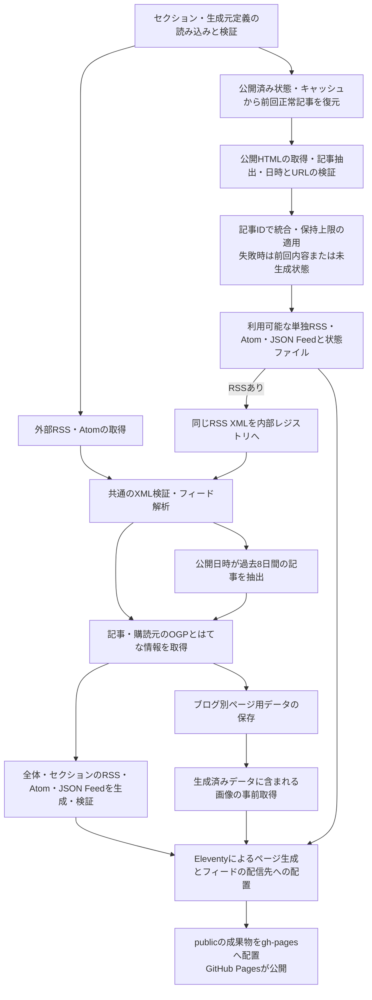

# 企業テックブログRSS

企業の技術ブログ、AI・クラウド・セキュリティなどの更新を、カテゴリ別のWebページとRSS・Atom・JSON Feedで配信する静的サイトです。通常のRSS・Atomと、HTMLの記事一覧から生成するフィードを扱います。

[公開サイト](https://fuhitonakagawa.github.io/my-tech-blog-rss-feed/) ／ [AIカテゴリ](https://fuhitonakagawa.github.io/my-tech-blog-rss-feed/rss/ai/)

このリポジトリは [yamadashy/tech-blog-rss-feed](https://github.com/yamadashy/tech-blog-rss-feed) のフォークです。開発者エージェントの作業方針・調査上の注意点は [AGENTS.md](AGENTS.md) に記載しています。

フォーク元の構成に沿った案内は [README-UPSTREAM-FORMAT.md](README-UPSTREAM-FORMAT.md) を参照してください。機能仕様・導入手順の詳細は本READMEに記載しています。

## 目次

- [📋 1. 機能と配信URL](#overview)
- [🚀 2. 導入と実行](#setup)
- [⚙️ 3. 設定](#configuration)
- [📡 4. サイトの追加方法](#サイトの追加方法)
- [🔄 5. 生成フィードの仕様](#generated-feeds)
- [🧪 6. 検証コマンド](#validation)
- [🌐 7. 自動更新と公開](#deployment)
- [📁 8. 構成と処理の流れ](#architecture)

<a id="overview"></a>

## 📋 1. 機能と配信URL

### 1.1. 閲覧と購読

- **カテゴリ別表示**: セクションごとの新着記事、購読リンク、ナビゲーションを提供します。
- **記事情報**: タイトル、概要、元記事URL、公開日時、取得可能なOG画像・はてなブックマーク数を表示します。
- **登録フィード一覧**: ヘッダーの一覧ボタンから、セクションごとの購読元を確認できます。
- **HTML由来のフィード**: 元サイトにRSSがなくても、定義した記事一覧から単独フィードを配信できます。

公開サイトの基点は `https://fuhitonakagawa.github.io/my-tech-blog-rss-feed` です。次のパスはこの基点からの相対パスです。

| 用途 | パス |
| --- | --- |
| 全体の新着ページ | `/` |
| 全体の集約フィード | `/feeds/rss.xml`、`/feeds/atom.xml`、`/feeds/feed.json` |
| セクションページ | `/rss/<セクションID>/` |
| セクションの集約フィード | `/rss/<セクションID>/feeds/rss.xml`、`atom.xml`、`feed.json` |
| ブログ一覧・ブログ別ページ | `/blogs/`、`/blogs/<ブログURLのハッシュ>/` |
| 人気記事ページ | `/hot/` |
| サイトマップ | `/sitemap.xml`、`/site.xml` |

### 1.2. 集約対象の期間

全体・セクションの新着集約は、公開日時が実行時点から過去8日間の範囲にある記事を対象とします。記事ごとの公開日時がないもの、期間外のもの、未来の日時を持つものは対象外です。画面上の「直近1週間」はこの集約結果を表示します。

登録フィード一覧には通常RSSの購読元を表示します。登録やXMLの取得に成功しても、新着集約の記事数が0件になることがあります。ブログ別ページの入力データと生成元ごとの単独フィードには、新着集約より古い記事も含まれます。

<a id="setup"></a>

## 🚀 2. 導入と実行

### 2.1. 必要な環境

- **ランタイム**: Node.js 24以上。CIの使用バージョンは [ランタイム指定（`.tool-versions`）](.tool-versions) を参照してください。
- **パッケージ管理**: npm。依存関係は [パッケージ定義（`package.json`）](package.json) と [ロックファイル（`package-lock.json`）](package-lock.json) で管理します。
- **接続先**: パッケージレジストリ、外部RSS・HTML・画像の公開URLにアクセスできる環境が必要です。

### 2.2. インストールと初回生成

リポジトリのルートで実行します。

```bash
node --version
npm --version
npm ci
npm run feed-generate
npm run site-prepare
npm run site-build
```

`npm ci`はロックファイルの依存関係をインストールします。フィード取得・生成の中間ファイルはサイト入力ディレクトリに、配信用の静的ファイルは `public/` に出力されます。

### 2.3. ローカルでの閲覧

フィード生成後に次を実行し、`http://localhost:8080/` を開きます。

```bash
npm run site-serve
```

`site-serve`はサイトのビルドとプレビューを行います。フィード定義や抽出処理を編集した場合は、`feed-generate`で入力データを再生成してください。

### 2.4. 実行コマンド

| コマンド | 用途・前提 |
| --- | --- |
| `npm run feed-generate` | 通常RSS取得、HTML由来のフィード生成、全体・セクションの集約、XML検証 |
| `npm run site-prepare` | 生成済みブログデータを対象とする画像の事前取得。`feed-generate`の出力が必要 |
| `npm run site-build` | Eleventyによる静的サイトの出力。生成済みフィードデータが必要 |
| `npm run site-serve` | 静的サイトのローカルプレビュー |
| `npm run build` | `feed-generate`と`site-build`の連続実行。画像の事前取得は含まない |
| `npm run cache-prune` | 期限を超えた取得キャッシュ・生成画像の削除。サイト生成前に使用 |
| `npm run register-index` | Google Indexing APIへのURL通知。通常の生成・公開とは独立した任意処理 |

Indexing APIへの通知には、生成済みブログデータ、対象サイトの権限、`storage/service_account.json`のサービスアカウント認証情報が必要です。このファイルはGit管理外で扱います。通常のRSS生成とローカル閲覧にはサービスアカウントは不要です。

<a id="configuration"></a>

## ⚙️ 3. 設定

| 設定対象 | 定義元 |
| --- | --- |
| サイトURL・タイトル・説明・著者・集約期間・取得上限 | [共通設定（`src/common/constants.ts`）](src/common/constants.ts) |
| セクションの表示順・表示名・所属フィード | [セクション定義（`src/resources/sections/`）](src/resources/sections/) |
| HTML由来の生成元・抽出設定 | [生成元定義（`src/resources/generated-feeds/`）](src/resources/generated-feeds/) |
| Eleventyの入力・出力・配信ファイル | [サイト設定（`eleventy.config.ts`）](eleventy.config.ts) |
| 定期更新・公開先ブランチ | [更新ワークフロー（`.github/workflows/generate-feed.yml`）](.github/workflows/generate-feed.yml) |

通常の生成処理は共通設定とJSON定義を参照し、必須の環境変数や`.env`ファイルはありません。フォーク先で配信する場合は、共通設定のサイトURL、リポジトリURL、著者、画像、任意のアクセス解析設定を配信先に合わせます。

<a id="サイトの追加方法"></a>

## 📡 4. サイトの追加方法

### 4.1. 通常のRSS・Atom

対象セクションの`feeds`へ、表示名とフィードURLを登録します。次は [AIセクションの定義（`ai.json`）](src/resources/sections/ai.json) にある通常RSSです。

```json
{
  "label": "OpenAI Developers",
  "url": "https://developers.openai.com/rss.xml"
}
```

```json
{
  "label": "Google Developers Blog",
  "url": "https://developers.googleblog.com/feeds/posts/default"
}
```

通常RSSのURLは外部の購読元です。HTML由来の生成フィード用ディレクトリへの定義は不要です。フィード名とURLはセクションをまたいで一意にします。

企業の技術ブログに加え、AIの公式開発者ブログ・製品情報など、セクションの対象に合う配信元を扱います。投稿サービス上の企業ブログも、運営主体と内容を確認して登録します。

### 4.2. セクション

`src/resources/sections/<セクションID>.json`を1セクション1ファイルで用意します。

```json
{
  "order": 400,
  "title": "表示名",
  "feeds": [
    {
      "label": "フィード名",
      "url": "https://example.com/feed.xml"
    }
  ]
}
```

- **ID**: ファイル名の拡張子を除いた部分です。先頭は英小文字または数字、以降は英小文字・数字・ハイフンを使用します。
- **表示順**: `order`の昇順です。同値の場合はID順です。登録時は原則として10刻みの未使用値を選びます。
- **表示名**: `title`がナビゲーション、ページ見出し、集約フィードのタイトルに使用されます。
- **生成物**: ページ、RSS・Atom・JSON Feed、ナビゲーション、サイトマップが定義から生成されます。

### 4.3. RSS非対応ページ

`src/resources/generated-feeds/<生成フィードID>.json`に生成元を定義します。IDの文字制約はセクションIDと同じです。次はClaudeの記事一覧に対するCSS抽出設定です。

```json
{
  "schemaVersion": 1,
  "label": "Claude Code Blog",
  "pageUrl": "https://claude.com/blog-category/claude-code",
  "language": "en",
  "extractor": {
    "type": "css",
    "itemSelector": "main .blog_cms_grid > .blog_cms_item",
    "titleSelector": "[fs-list-field=\"heading\"]",
    "linkSelector": "a[fs-list-element=\"item-link\"]",
    "dateSelector": "[fs-list-field=\"date\"]",
    "timeZoneOffset": "+00:00",
    "categorySelector": "[fs-list-field=\"category\"]"
  },
  "pollIntervalMinutes": 60,
  "maxItems": 50
}
```

| 項目 | 仕様 |
| --- | --- |
| `schemaVersion` | `1` |
| `label`・`pageUrl`・`language` | 表示名、取得する記事一覧URL、言語 |
| `extractor` | `css`、または許可リストに登録された`adapter` |
| `pollIntervalMinutes` | 正常な保存済み状態を再利用できる最小確認間隔。定期実行の起動間隔とは別の設定 |
| `maxItems` | 保存済み記事と取得記事の統合後に保持する最大件数 |

CSS方式では`itemSelector`、`titleSelector`、`linkSelector`、`dateSelector`、`timeZoneOffset`が必須です。記事要素内の子孫要素から値を取得し、リンクには`href`属性を使用します。任意項目は`dateAttribute`、`timeSelector`、`timeAttribute`、`summarySelector`、`categorySelector`、`creatorSelector`です。`timeAttribute`には`timeSelector`の指定も必要です。

固有の抽出規則が必要な場合は、[アダプター許可リスト（`adapter-registry.ts`）](src/feed/generated/adapter-registry.ts) に関数を登録し、`extractor`を`{"type":"adapter","name":"登録名"}`とします。定義JSONは任意のJavaScriptやファイルパスを実行しません。

所属はセクション側の`feeds`に指定します。同じ生成フィードを複数セクションに所属させることはできません。

```json
{
  "generatedFeedId": "claude-code-blog"
}
```

### 4.4. 生成元の一覧

| 生成フィードID | 表示名 | セクション | 抽出方式 |
| --- | --- | --- | --- |
| `serverless-operations` | Serverless Operations | `jp-tech-blog` | `serverless-operations`アダプター |
| `anthropic-news` | Anthropic Newsroom | `ai` | `anthropic-news`アダプター |
| `claude-announcements` | Claude Product announcements | `ai` | CSS |
| `claude-code-blog` | Claude Code Blog | `ai` | CSS |

<a id="generated-feeds"></a>

## 🔄 5. 生成フィードの仕様

### 5.1. 記事と日時

- **記事ID**: 正規化した元記事URLです。識別用クエリは保持し、追跡用クエリを除外します。
- **公開日時**: 元ページの掲載日を使用します。英語の月名・3文字略称にも対応し、存在しない日付を拒否します。時刻がないCSS抽出では指定タイムゾーンの午前0時、Anthropic NewsroomではUTCの午前0時として扱います。
- **必須情報**: タイトル・記事URL・公開日時が不正な記事は除外します。公開日時を実行時刻で補うことはありません。有効記事0件は生成元の異常です。
- **保持内容**: 前回正常記事と今回記事をIDで統合し、同一IDの値は今回取得分を優先します。公開日時の降順、IDの昇順で並べ、`maxItems`まで保持します。
- **内容更新日時**: 生成フィードの内容が同じ場合は`contentUpdatedAt`を維持します。記事の公開日時、確認日時とは別の値です。

### 5.2. 配信ファイルと状態

生成元ごとの基点は`/feeds/generated/<生成フィードID>/`です。

| ファイル | 内容 |
| --- | --- |
| `rss.xml`・`atom.xml`・`feed.json` | 購読用のRSS・Atom・JSON Feed |
| `snapshot.json` | 記事、生成元情報、内容更新日時などの復元用データ |
| `status.json` | `state`、確認日時、最終成功日時、内容更新日時 |

| `state` | 配信内容・画面表示 |
| --- | --- |
| `ok` | 正常な記事を配信。登録フィード一覧は「正常」 |
| `stale` | 取得・抽出に失敗し、前回正常内容を配信。一覧は「前回正常データを配信中」 |
| `unavailable` | 利用できる前回正常内容がなく、状態ファイルのみ出力。一覧には当該生成元の項目を表示しない |

未定義ID、重複する名前・URL、未登録アダプター、設定形式の不正はビルドエラーです。通信・抽出エラーは生成元ごとに状態へ反映します。

### 5.3. 接続と保存の制約

生成元HTMLの取得には公開ネットワーク接続の検証と10秒のタイムアウトがあり、HTMLレスポンスのサイズ上限は5 MiBです。1回の確認は一覧ページ1ページを対象とし、追加ページの巡回やログインは対象外です。

記事URLは公開可能なHTTP・HTTPSに限定し、認証情報、署名、秘密情報を含むURLを拒否します。状態ファイルには元記事の公開情報だけを保存します。公開済み`gh-pages`の生成状態を復元元とし、Actions Cacheを副経路として利用します。

<a id="validation"></a>

## 🧪 6. 検証コマンド

```bash
npm run test-coverage
npm run lint
npm audit --audit-level=moderate
```

| コマンド | 対象 |
| --- | --- |
| `npm run test-coverage` | 外部サイトに依存するテストを除くテストとカバレッジ |
| `npm run test-internal` | 外部テストを除くテスト |
| `npm run test` | 外部テストを含むテスト全体 |
| `npm run test-external` | 実サイトへのアクセスを伴う取得・生成テスト |
| `npm run test-external -- tests/external/generated-feed.test.ts` | 生成フィードの実サイト取得、単独RSS、内部集約、所属セクション |
| `npm run lint` | Biomeによる検査・自動修正、TypeScriptの型検査、Secretlint |
| `npm audit --audit-level=moderate` | ロックされた依存関係の脆弱性監査 |

生成物の確認は、導入手順と同じ`feed-generate`、`site-prepare`、`site-build`の順序で行います。外部取得を含むコマンドの結果は、プロセス終了コードに加えて対象フィードの出力でも確認してください。

<a id="deployment"></a>

## 🌐 7. 自動更新と公開

### 7.1. 更新ワークフロー

[更新ワークフロー（`generate-feed.yml`）](.github/workflows/generate-feed.yml) は、`main`へのpush、手動実行、定期スケジュールで起動します。スケジュールはUTCで定義され、JSTの朝から深夜を対象とする平日1時間間隔・週末2時間間隔の設定です。曜日の判定もUTCです。実際の起動時刻には遅延があり得ます。

buildジョブは読み取り権限でサイトを生成し、成果物をdeployジョブへ渡します。deployジョブが`gh-pages`へ配信内容を保存し、GitHub Pagesの公開処理へつながります。フォーク先でも、GitHub Pagesの公開元を`gh-pages`のルートに設定します。

同じ更新グループの実行が重なる場合は、先行する実行がキャンセルされます。deployは一時的な失敗に対して最大3回試行します。

### 7.2. 検証と公開の区別

[CIワークフロー（`ci.yml`）](.github/workflows/ci.yml) はlint・型・シークレット・ワークフロー・誤字・内部テスト・サイト生成を検証します。[外部テストワークフロー（`external-test.yml`）](.github/workflows/external-test.yml) は実サイトを対象とします。いずれも公開ワークフローとは別です。

公開確認には、更新ワークフローのbuild・deploy、GitHub Pagesの処理、配信先URLのHTTP応答と内容を使用します。生成フィードではXMLに加え、`status.json`とページの状態表示も確認できます。

<a id="architecture"></a>

## 📁 8. 構成と処理の流れ

### 8.1. 技術と入力・出力

TypeScriptを`tsx`で実行し、Eleventyが静的HTMLを出力します。RSS解析は`rss-parser`、XML検証は`fast-xml-parser`、HTML抽出はCheerio、フィード出力は`feed`、画像処理はEleventy Image、テストはVitestを使用します。常駐APIサーバーやデータベースはありません。

| 場所 | 役割 |
| --- | --- |
| `src/cli/` | フィード生成・画像準備・キャッシュ整理・任意のURL通知 |
| `src/resources/` | セクション・生成元の設定とその検証 |
| `src/feed/` | 外部取得、解析、集約、配信形式への変換、保存 |
| `src/feed/generated/` | HTML抽出、記事保持、前回状態の復元、単独フィード生成 |
| `src/common/` | 共通設定、URL・接続先検証、Eleventy用処理 |
| `src/site/` | テンプレート、画面データ、スタイル、画像 |
| `tests/` | 内部テスト、実サイトテスト、テスト用データ |
| `src/site/feeds/` | 全体フィードと`generated/`配下の単独フィード・状態 |
| `src/site/section-feeds/` | セクション別フィードの中間出力 |
| `src/site/blog-feeds/` | ブログ別ページの入力データ |
| `public/` | GitHub Pages向けの配信ファイル |
| `.cache/` | RSS・OGP・画像の取得キャッシュ |
| `.previous-site/` | 公開済み生成フィードの復元用ディレクトリ |

中間出力、取得キャッシュ、配信用ディレクトリはGit管理外です。

### 8.2. フィードとサイトの生成



### 8.3. ファイル一覧

<details>
<summary>ソース・設定・テスト・リポジトリ内資料の構成</summary>

取得データ・画面記録・個人メモはディレクトリ単位で示します。

```text
.
├── .agents/  # エージェント向け補助規則
│   └── rules/
│       └── base.md
├── .cursor/
│   └── rules/
│       └── base.mdc
├── .github/  # CI・公開ワークフロー
│   ├── actions/
│   │   ├── restore-feed-cache/
│   │   │   └── action.yml
│   │   └── save-feed-cache/
│   │       └── action.yml
│   ├── ISSUE_TEMPLATE/
│   │   └── new-feed-request.md
│   ├── workflows/
│   │   ├── ci.yml
│   │   ├── external-test.yml
│   │   └── generate-feed.yml
│   ├── CODEOWNERS
│   ├── copilot-instructions.md
│   ├── FUNDING.yml
│   ├── pull_request_template.md
│   └── renovate.json5
├── docs/  # フィード調査用資料
│   ├── copy.js
│   ├── memo.md
│   ├── rss.js
│   └── rss.md
├── src/  # アプリケーションとサイト入力
│   ├── @types/
│   │   ├── eleventy-fetch.d.ts
│   │   └── undici-dispatcher.d.ts
│   ├── cli/
│   │   ├── generate-feed-command.ts
│   │   ├── prepare-site-command.ts
│   │   ├── prune-cache-command.ts
│   │   └── register-index-command.ts
│   ├── common/
│   │   ├── constants.ts
│   │   ├── eleventy-cache-option.ts
│   │   ├── eleventy-utils.ts
│   │   └── url-guard.ts
│   ├── feed/
│   │   ├── generated/
│   │   │   ├── adapter-registry.ts
│   │   │   ├── anthropic-news.ts
│   │   │   ├── css-extractor.ts
│   │   │   ├── extractor.ts
│   │   │   ├── feed-builder.ts
│   │   │   ├── generated-feed-service.ts
│   │   │   ├── page-fetcher.ts
│   │   │   ├── publication-date.ts
│   │   │   ├── state-store.ts
│   │   │   └── types.ts
│   │   ├── common-util.ts
│   │   ├── feed-crawler.ts
│   │   ├── feed-generator.ts
│   │   ├── feed-storer.ts
│   │   ├── feed-validator.ts
│   │   ├── logger.ts
│   │   └── prune-cache.ts
│   ├── resources/
│   │   ├── generated-feeds/  # HTMLからの生成元定義
│   │   │   ├── anthropic-news.json
│   │   │   ├── claude-announcements.json
│   │   │   ├── claude-code-blog.json
│   │   │   └── serverless-operations.json
│   │   ├── sections/  # セクション定義
│   │   │   ├── ai-news.json
│   │   │   ├── ai.json
│   │   │   ├── autonomous-driving.json
│   │   │   ├── aws.json
│   │   │   ├── azure.json
│   │   │   ├── business-it.json
│   │   │   ├── company-tech-blog.json
│   │   │   ├── db.json
│   │   │   ├── developersio.json
│   │   │   ├── engineering.json
│   │   │   ├── gigazine.json
│   │   │   ├── gihyo.json
│   │   │   ├── google-cloud.json
│   │   │   ├── hacker-news.json
│   │   │   ├── hatena.json
│   │   │   ├── infoq.json
│   │   │   ├── itmedia.json
│   │   │   ├── jp-tech-blog.json
│   │   │   ├── jpcert.json
│   │   │   ├── menthas.json
│   │   │   ├── my-tech-blog-solo.json
│   │   │   ├── platform.json
│   │   │   ├── programming.json
│   │   │   ├── publickey.json
│   │   │   ├── qiita-ai.json
│   │   │   ├── qiita-cloud.json
│   │   │   ├── qiita-security.json
│   │   │   ├── qiita.json
│   │   │   ├── robotics.json
│   │   │   ├── security-advisory.json
│   │   │   ├── security.json
│   │   │   ├── speakerdeck.json
│   │   │   ├── tech-book.json
│   │   │   ├── techcrunch.json
│   │   │   ├── techno-edge.json
│   │   │   ├── thinkit.json
│   │   │   ├── zenn-ai.json
│   │   │   ├── zenn-cloud.json
│   │   │   ├── zenn-security.json
│   │   │   └── zenn.json
│   │   ├── feed-info-list.ts
│   │   └── generated-feed-list.ts
│   └── site/
│       ├── _data/
│       │   ├── lib/
│       │   │   ├── blog-feeds.ts
│       │   │   ├── dayjs-setup.ts
│       │   │   ├── feed-items-chunks.ts
│       │   │   ├── feed-items-hot.ts
│       │   │   └── last-modified-blogs-date.ts
│       │   ├── blogFeeds.js
│       │   ├── constants.js
│       │   ├── currentDate.js
│       │   ├── feedItemsChunks.js
│       │   ├── feedItemsHot.js
│       │   ├── lastModifiedBlogsDate.js
│       │   └── sections.js
│       ├── _includes/
│       │   ├── components/
│       │   │   ├── feed-item.ts
│       │   │   ├── feed-list-dialog.ts
│       │   │   ├── html-utils.ts
│       │   │   ├── nav.ts
│       │   │   ├── scripts.ts
│       │   │   ├── sitemap.ts
│       │   │   ├── top-section.ts
│       │   │   └── types.ts
│       │   ├── layouts/
│       │   │   └── main.11ty.ts
│       │   ├── scripts/
│       │   │   ├── feed-list-dialog.ts
│       │   │   ├── index.ts
│       │   │   └── relative-time.ts
│       │   └── styles/
│       │       ├── vendor/
│       │       │   ├── base.css
│       │       │   └── reset.css
│       │       └── main.css
│       ├── images/  # 静的画像
│       │   ├── alternate-feed-image.png
│       │   ├── apple-icon.png
│       │   ├── favicon.ico
│       │   ├── hatenabookmark-icon.png
│       │   ├── icon-github.png
│       │   ├── icon-transparent.png
│       │   ├── icon.png
│       │   ├── icon256-transparent.png
│       │   ├── icon512-transparent.png
│       │   ├── icon512.png
│       │   ├── og-image.png
│       │   └── slack-mark.png
│       ├── styles/
│       │   └── bundle-css.njk
│       ├── blog-feed.11ty.ts
│       ├── blogs.11ty.ts
│       ├── hot.11ty.ts
│       ├── index.11ty.ts
│       ├── section.11ty.ts
│       ├── site.11ty.ts
│       └── sitemap.11ty.ts
├── tests/  # 内部・外部テスト
│   ├── external/
│   │   ├── feed-availability.test.ts
│   │   ├── generate-feed.test.ts
│   │   └── generated-feed.test.ts
│   ├── feed/
│   │   └── generated/
│   │       ├── anthropic-news.test.ts
│   │       └── claude-announcements.test.ts
│   ├── helpers/
│   │   └── site-data-fixtures.ts
│   ├── blog-feeds.test.ts
│   ├── common-util.test.ts
│   ├── eleventy-utils.test.ts
│   ├── feed-crawler.test.ts
│   ├── feed-generator.test.ts
│   ├── feed-info-list.test.ts
│   ├── feed-item.test.ts
│   ├── feed-items-chunks.test.ts
│   ├── feed-items-hot.test.ts
│   ├── feed-list-dialog.test.ts
│   ├── feed-storer.test.ts
│   ├── feed-validator.test.ts
│   ├── generated-adapter-registry.test.ts
│   ├── generated-css-extractor.test.ts
│   ├── generated-feed-list.test.ts
│   ├── generated-feed-service.test.ts
│   ├── generated-feed-state-store.test.ts
│   ├── generated-page-fetcher.test.ts
│   ├── html-utils.test.ts
│   ├── last-modified-blogs-date.test.ts
│   ├── nav.test.ts
│   ├── prune-cache.test.ts
│   ├── test-setup.ts
│   ├── top-section.test.ts
│   └── url-guard.test.ts
├── .editorconfig  # エディター設定
├── .gitignore  # Git管理対象外の指定
├── .node-version  # Nodeバージョン管理用指定
├── .playwright-mcp/  # 画面状態の記録
├── .secretlintignore  # 秘密情報検査の除外指定
├── .secretlintrc.json  # 秘密情報検査設定
├── .tool-versions  # CIが参照するランタイム指定
├── .typos.toml  # 誤字検査設定
├── AGENTS.md  # 開発判断と継続指示
├── biome.json  # フォーマット・静的検査設定
├── CLAUDE.md  # エージェント向け案内
├── eleventy.config.ts  # 静的サイト生成設定
├── LICENSE.txt  # ライセンス本文
├── my-docs/  # 個人の調査メモ
├── package-lock.json  # 依存バージョンの固定
├── package.json  # npmコマンドと依存定義
├── README.md  # 機能・導入・操作仕様
├── README-UPSTREAM-FORMAT.md  # フォーク元形式の案内
├── tsconfig.json  # TypeScript設定
├── vitest.config.ts  # テスト・カバレッジ設定
└── vitest.external.config.ts  # 実サイトテスト設定
```

</details>
